# SchedulingEngine — Action Plan & Revised Implementation Roadmap

**Companion to:** `SchedulingEngine_Architecture_Review.md`
**Supersedes the scheduling-engine portions of:** `IMPLEMENTATION_GUIDE.md` (which already defines a Phase 0 "Fix Blockers" — this sharpens it with the *specific* blockers found).
**Governing principle (yours):** correctness and feature-completeness **before** structural refactoring; determinism is a mechanical gate, not a manual review.

---

## 0. How to read this plan

- **Sprints** are 1 week each, sized for a solo developer (you). Adjust freely.
- **Priority:** P0 (blocks the modular PWA from being usable at all) → P3 (future/SaaS).
- **Effort:** S ≤ ½ day · M ≤ 3 days · L ≤ 1 week · XL > 1 week.
- **Owner:** Dev (build) · QA (test) · Arch (design decision).
- **Status:** ☐ todo · ◐ in progress · ☑ done.
- Every P0/P1 task names its **exit test** — the thing that proves it's done. No task is "done" without its test green.

---

## 1. Milestone overview

```mermaid
gantt
  title StudentShiftScheduler — modular PWA to daily-use product
  dateFormat X
  axisFormat %s
  section M1 Runnable
  Create SchedulerUtils + loader      :m1a, 0, 1
  Golden-master + regression tests    :m1b, 1, 2
  section M2 Fast & Correct
  Hour counters + caches              :m2a, 2, 3
  SSD rebalance + parity passes       :m2b, 3, 4
  section M3 Robust
  Validation boundary + DTO reads     :m3a, 4, 5
  Break up god-files; quarantine srv  :m3b, 5, 6
  section M4 Future
  Assessment-first-class + swaps      :m4a, 6, 8
  CP-SAT backend (flagged)            :m4b, 8, 10
```



| Milestone | Outcome | Definition of done |
|---|---|---|
| **M1 — Runnable & Frozen** | Modular PWA boots and reproduces the real schedule | Loader opens app; `runSchedule` byte-identical to baseline; CI green |
| **M2 — Fast & Correct** | Performance fixed; best algorithm ported | 60-student month < 1 s; SSD rebalance provably converges (test) |
| **M3 — Robust** | Bad data can't corrupt; clean boundaries | `validateState` rejects bad import; no `engine.state` reads in views |
| **M4 — Future** | Assessment-first-class, swaps, SaaS path | Swap marketplace live; CP-SAT behind flag at scale |

---

## 2. Sprint plan (the order that de-risks fastest)

### Sprint 1 — "Make it run, then freeze it" (P0)
**Goal:** the modular PWA opens in a browser and generates your real Sept/Oct schedule, and a test guarantees it never silently changes.

1. **Create `src/core/utils.js` exporting a global `SchedulerUtils`** with `parseTimeStr, timeStr, dateISO, localDateStr, stableColor, overlap, weekIndexInMonth` (exact code in Review §3.1 and Refactoring Guide §2).
   - *Exit test:* `utils.spec.js` — round-trips, underflow `timeStr(390-60)==='05:30'`, `localDateStr` tz-stable.
2. **Pick the module system = global namespace** (lowest friction). Convert the 5 ESM files (`utils, state, parse, parseGoogle, calendar`) to global style.
   - *Exit test:* boot smoke test under jsdom asserts `window.SchedulingEngine/ScheduleView/AssessmentManager/...` all defined.
3. **Create `public/index.html` loader** with `<script>` tags in dependency order (order in Refactoring Guide §3).
   - *Exit test:* open in a real browser → calendar renders, "Generate" produces a schedule, no console errors.
4. **Capture the golden master** from the real `schedule.csv` scenario; commit the hash of `scheduleToShifts()`.
   - *Exit test:* `golden.spec.js` re-runs and matches the committed hash.
5. **Decide the test-day availability policy** (Review §4.1). Write it down. Implement the configurable guard.
   - *Exit test:* both policy tests pass; chosen default documented in README.

**Sprint 1 exit (M1):** ☐ PWA boots ☐ real schedule reproducible & hashed ☐ policy decided ☐ CI green.

### Sprint 2 — "Fast & counters" (P2 perf)
6. Add `monthMinutes/weekMinutes/consistency` counters to RunContext; route all assignee changes through one `assign()/unassign()` (Review §5.3).
   - *Exit test:* counter-invariant test (counters == recomputed totals after a run); golden master still matches.
7. Fix `getFairnessComponent` O(S²·N) via per-pass aggregate cache.
   - *Exit test:* perf benchmark — 60-student month < 1 s; output unchanged vs golden.
8. Precompute `shift._dow/_dateObj` in `normalizeShiftInPlace`.

**Sprint 2 exit:** ☐ < 1 s at 60 students ☐ golden unchanged ☐ benchmark recorded.

### Sprint 3 — "Port your best algorithm" (P1)
9. Implement `RebalanceSSD` strategy (your Fix C) in the engine (Review §7.4).
   - *Exit test:* SSD strictly non-increasing; no improving swap remains (optimality witness); terminates.
10. Restore pair-transfer + consistency-preserving pass.
    - *Exit test:* pair-only scenario performs ≥1 pair move.
11. Lexicographic open/close fairness as a second SSD pass.
    - *Exit test:* equal-hours schedule → openings variance strictly reduced without worsening hours.
12. Extract `ChainModel` + `ScoringModel`; delete the duplicate chain code.

**Sprint 3 exit (M2):** ☐ convergent rebalance ☐ parity passes restored ☐ lexicographic edges ☐ no duplicated scoring.

### Sprint 4 — "Robust & clean" (P1/P2)
13. `validateState` + `AvailabilityManager.validate` at import; fail-loud on bad availability (no silent "never available").
14. Unify `testDates` vs `unavailable_dates` (Review §6.2); make CSV import feed the canonical field.
15. DTO-only reads in views; remove every `engine.state.schedule[...]` from `schedule.js`; freeze DTOs in dev.
16. Escape all HTML sinks; add prototype-pollution guard in CSV/JSON hydration.
17. Quarantine Layer-3 backend into `server/`.

**Sprint 4 exit (M3):** ☐ import validation ☐ assessment fed ☐ no aliasing ☐ XSS/proto guarded ☐ backend separated.

### Sprint 5 — "Maintainability"
18. Break up `schedule.js` (1,383 lines) → `ScheduleController` + `CalendarRenderer` + `ShiftModals`.
19. Move scheduling-engine code into `src/engine/` tree (Review §12); composition root in `app.js` with DI.

### Sprints 6–10 — "Future / SaaS" (P3)
20. Assessment intervals as first-class scheduling concept.
21. Swap marketplace (debt tracking, peer cover, debt-transfer rules) — your deferred feature.
22. Preference component + availability confidence.
23. Schedule simulation (Monte-Carlo best-of-N).
24. CP-SAT backend behind a feature flag for institution scale.

---

## 3. Master Action Checklist (~110 items)

Legend — **Pri:** P0/P1/P2/P3 · **Eff:** S/M/L/XL · **Impact:** ●●● high / ●● med / ● low · **Owner:** Dev/QA/Arch · **St:** ☐ todo.

### A. P0 — Make the modular PWA runnable (Sprint 1)

> **Status update (2026-06-30):** Items A1–A16 are **resolved** in the current modular PWA. `SchedulerUtils` is implemented at `src/js/core/utils.js` (`window.SchedulerUtils`); `AppStateManager` is implemented at `src/js/core/state.js`. The global namespace is adopted; the PWA boots. Items A17–A20 (test runner + golden master) remain open.

| # | Action | Pri | Eff | Impact | Owner | St |
|---|---|---|---|---|---|---|
| A1 | Create `src/core/utils.js` exposing global `SchedulerUtils` | P0 | S | ●●● | Dev | ☑ |
| A2 | Implement `parseTimeStr` + `timeStr` (with under/overflow wrap) | P0 | S | ●●● | Dev | ☑ |
| A3 | Implement `localDateStr` (local, not `toISOString`) | P0 | S | ●●● | Dev | ☑ |
| A4 | Implement `dateISO`, `overlap`, `stableColor`, `weekIndexInMonth` | P0 | S | ●●● | Dev | ☑ |
| A5 | Export `SchedulerUtils` for both `window` and Node (`module.exports`) | P0 | S | ●● | Dev | ☑ |
| A6 | Decide module system → **global namespace** (record decision) | P0 | S | ●●● | Arch | ☑ |
| A7 | Convert `utils.js` ESM→global | P0 | S | ●●● | Dev | ☑ |
| A8 | Convert `state.js` ESM→global | P0 | S | ●● | Dev | ☑ |
| A9 | Convert `parse.js` ESM→global | P0 | S | ●● | Dev | ☑ |
| A10 | Convert `parseGoogle.js` ESM→global | P0 | S | ●● | Dev | ☑ |
| A11 | Convert `calendar.js` ESM→global | P0 | S | ●● | Dev | ☑ |
| A12 | Reconcile `main.js` init with global loader (retire ESM import) | P0 | M | ●● | Dev | ☑ |
| A13 | Create `public/index.html` loader with ordered `<script>` tags | P0 | S | ●●● | Dev | ☑ |
| A14 | Verify load order: utils→state→logger→managers→engine→views→app | P0 | S | ●●● | Dev | ☑ |
| A15 | Boot smoke test (jsdom): all `window.*` classes defined | P0 | S | ●●● | QA | ☑ |
| A16 | Manual browser check: calendar renders, Generate works, 0 console errors | P0 | S | ●●● | QA | ☑ |
| A17 | Wire a test runner (Vitest recommended; Jest acceptable) + CI | P0 | M | ●●● | QA | ☐ |
| A18 | Add `schedule.csv` as a test fixture under `tests/fixtures/` | P0 | S | ●● | QA | ☐ |
| A19 | Capture golden master (hash of `scheduleToShifts()`) from real data | P0 | M | ●●● | QA | ☐ |
| A20 | `golden.spec.js` asserts byte-identical output vs committed hash | P0 | S | ●●● | QA | ☐ |

### B. P0/P1 — Regression tests that pin the already-fixed bugs

| # | Action | Pri | Eff | Impact | Owner | St |
|---|---|---|---|---|---|---|
| B1 | Test: `localDateStr` previous-day is local under `TZ=Africa/Johannesburg` | P0 | S | ●●● | QA | ☐ |
| B2 | Test: weekly window covers Sun..Sat local (no UTC shift) | P0 | S | ●●● | QA | ☐ |
| B3 | Test: fairness == recomputed edges after run+rebalance (no drift) | P0 | S | ●●● | QA | ☐ |
| B4 | Test: adjacent edge slots don't stack-overflow (`skipExtension`) | P0 | S | ●● | QA | ☐ |
| B5 | Test: no required-1 slot ever holds 2 assignees | P0 | S | ●●● | QA | ☐ |
| B6 | Test: deterministic — two runs byte-identical | P0 | S | ●●● | QA | ☐ |
| B7 | Property test: ∀ shift `assignees.length ≤ maxCapacity` | P1 | M | ●●● | QA | ☐ |
| B8 | Property test: ∀ student weekly hours ≤ weekly_max | P1 | M | ●● | QA | ☐ |
| B9 | Property test: ∀ student monthly hours ≤ contracted cap | P1 | M | ●● | QA | ☐ |

### C. P1 — Parity & semantic decisions (Sprints 1 & 3)

| # | Action | Pri | Eff | Impact | Owner | St |
|---|---|---|---|---|---|---|
| C1 | **Decide test-day policy**: block pre-exam shifts or not | P1 | S | ●●● | Arch | ☐ |
| C2 | Implement configurable `preExam` policy in `shiftConflictsWithStudentTest` | P1 | M | ●●● | Dev | ☐ |
| C3 | Test both policies (pre-exam allowed / blocked; post-buffer always) | P1 | S | ●● | QA | ☐ |
| C4 | Change weekly-target divisor → dynamic operational weeks | P1 | M | ●● | Dev | ☐ |
| C5 | Port `operationalWeeksInMonth` helper into engine | P1 | S | ●● | Dev | ☐ |
| C6 | Test: weekly target = monthly / operational-week-count | P1 | S | ●● | QA | ☐ |
| C7 | Port SSD-decrease `rebalance` (Fix C) as `RebalanceSSD` strategy | P1 | M | ●●● | Dev | ☐ |
| C8 | Test: SSD strictly non-increasing + terminates + optimality witness | P1 | M | ●●● | QA | ☐ |
| C9 | Restore monolith's pair (two-slot) transfer | P1 | M | ●● | Dev | ☐ |
| C10 | Restore consistency-preserving rebalance pass | P1 | M | ●● | Dev | ☐ |
| C11 | Test: pair-only scenario performs a pair move | P1 | S | ●● | QA | ☐ |
| C12 | Unify monthly-default rule via `ContractManager.defaultMonthlyFor` | P1 | M | ●● | Dev | ☐ |
| C13 | Test: blank monthly contract resolves identically on every path | P1 | S | ●● | QA | ☐ |
| C14 | Unify `testDates` vs `unavailable_dates`; choose canonical field | P1 | M | ●●● | Arch | ☐ |
| C15 | CSV/Form import writes exams to the canonical field | P1 | M | ●●● | Dev | ☐ |
| C16 | Test: assessment workflow actually blocks exam-day slots | P1 | M | ●● | QA | ☐ |
| C17 | Generalise pattern locks beyond "first week" (2-week robustness) | P1 | M | ●● | Dev | ☐ |
| C18 | Test: pattern locks survive an exam-week first week | P1 | S | ●● | QA | ☐ |
| C19 | Derive adjacency step from `state.granularity` (not hard-coded 60) | P1 | M | ● | Dev | ☐ |
| C20 | Test: adjacency respects 30-min granularity | P1 | S | ● | QA | ☐ |
| C21 | **Confirm `suggestEarlyOpeningForLargeTests`**: port or document drop | P1 | M | ●● | Arch | ☐ |
| C22 | If ported: test large-test early-open creates the extra opening | P1 | M | ●● | QA | ☐ |
| C23 | Verify `adjustTestShiftCapacity` parity (per-test capacity tuning) | P1 | M | ●● | Dev | ☐ |
| C24 | Verify 3-month view runs engine ×3 with fresh context | P1 | M | ● | Dev | ☐ |
| C25 | Verify `StorageManager` save/load round-trips schedule (IndexedDB) | P1 | M | ●● | QA | ☐ |

### D. P2 — Performance (Sprint 2)

| # | Action | Pri | Eff | Impact | Owner | St |
|---|---|---|---|---|---|---|
| D1 | Add `monthMinutes[sid]` counter to RunContext | P2 | M | ●●● | Dev | ☐ |
| D2 | Add `weekMinutes[sid:weekIdx]` counter | P2 | M | ●●● | Dev | ☐ |
| D3 | Add `consistency[sid:dow:start]` counter | P2 | M | ●● | Dev | ☐ |
| D4 | Single `assign()/unassign()` chokepoint updates all counters | P2 | M | ●●● | Dev | ☐ |
| D5 | Route every assignee mutation through the chokepoint | P2 | M | ●●● | Dev | ☐ |
| D6 | `getTotalMonthlyHours` reads counter O(1) | P2 | S | ●●● | Dev | ☐ |
| D7 | `getWeeklyAssignedHours` reads counter O(1) | P2 | S | ●●● | Dev | ☐ |
| D8 | `getConsistencyScore` reads counter O(1) | P2 | S | ●● | Dev | ☐ |
| D9 | Per-pass aggregate cache (avg hours, min/max edges) | P2 | M | ●●● | Dev | ☐ |
| D10 | `getFairnessComponent` uses aggregate (kill O(S²·N)) | P2 | M | ●●● | Dev | ☐ |
| D11 | Precompute `shift._dow` and `shift._dateObj` | P2 | S | ●● | Dev | ☐ |
| D12 | Reuse context `studentMap` in `scheduleToShifts` | P2 | S | ● | Dev | ☐ |
| D13 | Integer-map IDs for tie-break compares (drop `localeCompare`) | P2 | S | ● | Dev | ☐ |
| D14 | Counter-invariant test (counters == recompute) | P2 | M | ●●● | QA | ☐ |
| D15 | Benchmark harness: run-time vs students {5,10,20,40,60,100} | P2 | M | ●● | QA | ☐ |
| D16 | Assert 60-student month < 1 s; record baseline | P2 | S | ●● | QA | ☐ |
| D17 | Golden master unchanged after all perf changes | P2 | S | ●●● | QA | ☐ |

### E. P2 — Scheduler quality

| # | Action | Pri | Eff | Impact | Owner | St |
|---|---|---|---|---|---|---|
| E1 | Lexicographic edges: 2nd SSD pass on openings | P2 | M | ●● | Dev | ☐ |
| E2 | Lexicographic edges: 3rd SSD pass on closings | P2 | M | ●● | Dev | ☐ |
| E3 | Add `student.preferences` (preferredDays/start/avoid) to model | P2 | M | ●● | Dev | ☐ |
| E4 | Add `preference` weight to `SCORE_WEIGHTS`; score it | P2 | M | ●● | Dev | ☐ |
| E5 | Feed `AvailabilityManager` confidence (draft/submitted) into scoring | P2 | M | ● | Dev | ☐ |
| E6 | Per-week load balancing (not just per-month) | P2 | M | ●● | Dev | ☐ |
| E7 | Extract `ChainModel` (dedupe monolith/engine) | P2 | M | ●● | Dev | ☐ |
| E8 | Extract `ScoringModel` (single weighted model) | P2 | M | ●● | Dev | ☐ |
| E9 | Surface "your usual shift" predictability hint to students | P2 | M | ● | Dev | ☐ |
| E10 | Test: preference improves perceived fit without breaking caps | P2 | M | ● | QA | ☐ |

### F. P1/P2 — Robustness & security

| # | Action | Pri | Eff | Impact | Owner | St |
|---|---|---|---|---|---|---|
| F1 | `validateState(state)` returns structured errors | P1 | M | ●●● | Dev | ☐ |
| F2 | Run `AvailabilityManager.validate` at import; reject/flag overlaps | P1 | M | ●● | Dev | ☐ |
| F3 | Fail loud on bad availability JSON (no silent "never available") | P1 | M | ●●● | Dev | ☐ |
| F4 | Escape **all** user text in view HTML sinks (`escapeHtml` everywhere) | P1 | M | ●●● | Dev | ☐ |
| F5 | ESLint/grep rule forbidding raw `${...}` in `innerHTML` | P2 | S | ●● | QA | ☐ |
| F6 | Prototype-pollution guard in CSV/JSON hydration (`Object.create(null)`) | P1 | S | ●● | Dev | ☐ |
| F7 | Verify CSV export escapes leading `= + - @` (injection) | P2 | S | ●● | Dev | ☐ |
| F8 | DTO-only reads in views; remove `engine.state.schedule[...]` pokes | P1 | M | ●●● | Dev | ☐ |
| F9 | Freeze returned DTOs (`Object.freeze`) in dev mode | P2 | S | ●● | Dev | ☐ |
| F10 | Collect per-run `warnings[]`; surface in UI | P2 | M | ●● | Dev | ☐ |
| F11 | Add JSDoc `@typedef`s from the §6.3 schemas | P2 | M | ●● | Dev | ☐ |
| F12 | Add `assignees.length ≤ maxCapacity` assertion in `assign()` | P1 | S | ●●● | Dev | ☐ |

### G. P2 — Architecture & maintainability (Sprints 4–5)

| # | Action | Pri | Eff | Impact | Owner | St |
|---|---|---|---|---|---|---|
| G1 | Quarantine Layer-3 backend into `server/` | P2 | S | ●● | Arch | ☐ |
| G2 | Move monolith to `legacy/index.html` (frozen reference) | P2 | S | ●● | Arch | ☐ |
| G3 | Create `src/engine`, `src/domain`, `src/io`, `src/ui`, `src/core` tree | P2 | M | ●● | Arch | ☐ |
| G4 | Composition root `app.js` with DI (inject utils/managers/logger) | P2 | M | ●●● | Arch | ☐ |
| G5 | Engine takes `deps.utils` (injected) not global `SchedulerUtils` | P2 | M | ●●● | Dev | ☐ |
| G6 | Break `schedule.js` → `ScheduleController` | P2 | L | ●● | Dev | ☐ |
| G7 | Extract `CalendarRenderer` from `schedule.js` | P2 | L | ●● | Dev | ☐ |
| G8 | Extract `ShiftModals` from `schedule.js` | P2 | M | ● | Dev | ☐ |
| G9 | Define `ISchedulerPort` (narrow interface views depend on) | P2 | M | ●● | Arch | ☐ |
| G10 | Logging levels (debug/info/warn); gate debug behind flag | P2 | M | ●● | Dev | ☐ |
| G11 | Align `package.json` paths to real structure (`main`, `start`, build) | P2 | S | ● | Dev | ☐ |
| G12 | Fix `author`/repo metadata (currently "University of Pretoria") | P3 | S | ● | Dev | ☐ |
| G13 | Golden master green after every extraction (byte-identical gate) | P2 | M | ●●● | QA | ☐ |

### I. Worked-Hours / Reconciliation prerequisites (Prompts B1–F1)

> **Track independence:** engine-independent; no scheduling assignment logic changes. All new modules are additive. Headless modules must not require a live `AppStateManager` instance — pass data in. Full acceptance criteria and model assignments: `Documentation/Cursor_Prompts_WorkedHours_Integration.md`. Canonical spec: `Documentation/prelude.md §0`.
>
> **Sequencing:** B1 → B2 → (B3 optional, may follow B2) → C1 → (C2 optional, may follow C1) → D1 → (D2 optional, may follow D1) → E1 → E2 → E3 → F1.

#### Worked-hours prerequisites checklist (Prompt A4)

Gate items that must be satisfied (or already are) before the B→F build proceeds. Status reflects repo as of **2026-06-30**.

| # | Prerequisite | Status | Repo / notes | Prompt |
|---|---|---|---|---|
| **(a)** | **SheetJS** — browser `window.XLSX` + Node `xlsx` for harness | **NOT STARTED** | Not in `package.json`; no script tag in `index.html` | **B1** |
| **(b)** | **`timeEntries` IndexedDB store** — `dbVersion` 1→2, idempotent upsert on `username\|shiftStartedISO` | **NOT STARTED** | `storage.js` is `dbVersion: 1`; no `timeEntries` store or query methods | **B2** |
| **(c)** | **`OUTSIDE_HOURS` uses per-date operational hours** — payroll `PolicyFlags` reads op-hours config (never hardcode 06:00–19:00) | **NOT STARTED** (engine config **DONE**) | Engine: `state.operationalHours` + `SchedulingEngine.getOperationalHours` per date. Payroll path: no `policyFlags.js` yet | **D2** |
| **(d)** | **Contract-period calendar in ledger module** — Mar–May … Nov-final periods for carry / claim policy | **DONE** | `hoursLedger.js` `DEFAULT_CONTRACT_PERIODS`; I7–I10 self-check. **E3** extends for clocked `Stud` only — does not rebuild periods | **E3** |
| **(e)** | **Month keys on calendar `YYYY-MM`** — align `StorageManager.monthScheduleId` with `HoursLedger.monthKey`; migrate legacy `saveSchedule` ids | **PARTIAL** | `HoursLedger.monthKey(year, monthIndex)` uses `monthIndex + 1`. `StorageManager.monthScheduleId(year, month)` pads JS 0-indexed `month` without `+1`; legacy `saveSchedule` may write unpadded ids | **B3** |

**Reading:** (a) and (b) are hard gates for any payroll ingest. (c) can proceed in parallel once D1 exists but needs engine op-hours config (already present). (d) is done — E3 only switches `Stud` source to clocked. (e) should land before or alongside B2/E1 so schedule reads and `timeEntries.monthKey` agree.

| # | Action | Pri | Eff | Impact | Owner | St |
|---|---|---|---|---|---|---|
| I1 | **B1 — SheetJS:** add vendored or CDN `window.XLSX`; add `xlsx` devDependency for Node harness; do not reorder existing app script tags | P1 | S | ●●● | Dev | ☐ |
| I2 | **B2 — `timeEntries` store:** bump `storage.js` `dbVersion` 1→2; add `timeEntries` store keyed `username\|shiftStartedISO` with indexes on `username`, `dateISO`, `monthKey` (calendar `YYYY-MM`) | P1 | M | ●●● | Dev | ☐ |
| I3 | **B2 — upsert + query:** `upsertTimeEntries` (idempotent), `getTimeEntriesForMonth`, `getTimeEntriesForStudent`, `clearTimeEntries`; double-upload → same count (exit test) | P1 | M | ●●● | Dev | ☐ |
| I4 | **B3 — month-key alignment:** standardize all schedule ids on calendar `YYYY-MM` (`jsMonthIndex + 1`); fix `StorageManager.monthScheduleId`; migrate legacy `saveSchedule` ids; align with `HoursLedger.monthKey` semantics | P1 | M | ●●● | Dev | ☐ |
| I5 | **C1 — `PayrollParser`:** new `src/js/core/payrollParser.js` → `window.PayrollParser.parseWorkbook(arrayBuffer)`; `\u00a0` header normalize; prototype-pollution-safe header map; drop IP fields; duration sanity-check vs `Total Time`; anomaly flags; deterministic output; add `<script>` tag after SheetJS | P1 | M | ●●● | Dev | ☐ |
| I6 | **C2 — `IdentityMap`:** new `src/js/core/identityMap.js` → `window.IdentityMap.resolve(entries, students)`; email prefix → normalized full name → pending bucket; persisted override table in settings store | P1 | M | ●●● | Dev | ☐ |
| I7 | **D1 — `WorkedHoursNormalizer`:** new `src/js/core/workedHoursNormalizer.js`; pure functions; admin-row bypass (accept verbatim); `round_in`/`round_out` per spec; `max(0, recorded_end − recorded_start)`; worked examples in comments | P1 | M | ●●● | Dev | ☐ |
| I8 | **D2 — `PolicyFlags`:** new `src/js/core/policyFlags.js` → `PolicyFlags.evaluate(session, ctx)`; per-date op-hours from operational-hours config (never hardcode); `OUTSIDE_HOURS`, `OVER_5H`, `TEST_CONFLICT` (interim: `AssessmentManager.allExamsForStudent`); `ZERO_DURATION`, `OPEN_SESSION`, `NEGATIVE_DURATION`, `EDITED`; flag-for-review, never auto-discard; `UNROSTERED`/`ABSENCE` in E2 only | P1 | M | ●● | Dev | ☐ |
| I9 | **E1 — `EffectiveRoster`:** new `src/js/core/effectiveRoster.js` → `EffectiveRoster.forRange(start, end)`; load via `StorageManager.getMonthSchedule`; apply approved swaps + `swapDebts` (from IndexedDB meta/export, same shape `AppStateManager` persists) + admin overrides; chain swaps (A→B→C resolves to C); read-only; no monolith runtime dependency | P1 | M | ●●● | Dev | ☐ |
| I10 | **E2 — `Reconcile`:** new `src/js/core/reconcile.js` → `Reconcile.run({ monthKey })`; full pipeline per spec; output adherence series + monthly clocked `Stud` + flagged sessions + absences | P1 | L | ●●● | Dev | ☐ |
| I11 | **E3 — Extend `HoursLedger` to v1.3:** **extend** existing `src/js/core/hoursLedger.js` (do not create new file); add `buildStudentLedgerFromClocked` / `studSource:'assigned'\|'clocked'` param; adherence series helper; bump `VERSION` to `'1.3'` when clocked feed wired; retain assigned fallback until upload; update `AppStateManager.getHoursLedgerReport` to prefer clocked when reconciliation data exists | P1 | M | ●●● | Dev | ☐ |
| I12 | **F1 — Hours golden-master harness:** `tests/harness/hours.js` + `npm run harness:hours`; fixtures: real DetailedPayroll `.xls` + saved schedule JSON; two consecutive runs → byte-identical snapshot; separate from scheduling engine harness | P1 | M | ●●● | QA | ☐ |
| I13 | Test: `EffectiveRoster` A→B→C swap chain resolves to C; post-swap assignee correct; swap does not false-flag `ABSENCE`/`UNROSTERED` | P1 | M | ●●● | QA | ☐ |
| I14 | Test: `HoursLedger` §8 self-check (`Σ worked_minutes`) holds on clocked sample; v1.2 assigned path still works when no payroll data present | P1 | M | ●●● | QA | ☐ |
| I15 | Test: `PayrollParser` — real export parses cleanly; no IP fields in output; open sessions flagged; re-upload same file → same row count | P1 | M | ●●● | QA | ☐ |

### H. P3 — Future / SaaS (Sprints 6–10)

| # | Action | Pri | Eff | Impact | Owner | St |
|---|---|---|---|---|---|---|
| H1 | Promote assessment intervals to first-class scheduling concept | P3 | M | ●● | Arch | ☐ |
| H2 | Swap marketplace: `SwapDebt` schema + contractual hour-debt tracking | P3 | L | ●● | Dev | ☐ |
| H3 | Swap marketplace: peer-to-peer cover with debt-transfer rules | P3 | L | ●● | Dev | ☐ |
| H4 | Swap marketplace UI wired to engine validation | P3 | M | ● | Dev | ☐ |
| H5 | Schedule simulation (Monte-Carlo best-of-N by SSD+fairness) | P3 | M | ●● | Dev | ☐ |
| H6 | Conflict prediction (flag swap-likely slots pre-publish) | P3 | M | ● | Dev | ☐ |
| H7 | Multi-objective Pareto view (coverage/fairness/preference) | P3 | L | ● | Arch | ☐ |
| H8 | CP-SAT (OR-Tools) backend behind a feature flag | P3 | XL | ●● | Arch | ☐ |
| H9 | Data model verified CP-SAT-ready (constraints expressible) | P3 | M | ●● | Arch | ☐ |
| H10 | Backend concurrency: versioned optimistic locking on save | P3 | M | ●● | Dev | ☐ |
| H11 | Backend: `express-validator` allow-lists on all request bodies | P3 | M | ●● | Dev | ☐ |
| H12 | Mutation testing pass; raise suite to ≥80% meaningful coverage | P3 | L | ●● | QA | ☐ |
| H13 | AI-assisted "explain this schedule / suggest an edit" feature | P3 | M | ● | Dev | ☐ |

---

## 4. Definition of Done (per priority)

- **P0 done** ⇔ PWA boots in a browser, real schedule reproduces byte-identically (golden master), and CI is green.
- **P1 done** ⇔ each parity item has an explicit decision (where it diverges) and a passing test; SSD rebalance converges with an optimality-witness test.
- **P2 done** ⇔ 60-student month < 1 s, golden master unchanged, no `engine.state` reads in views, all HTML sinks escaped.
- **P3 done** ⇔ swap marketplace live; CP-SAT selectable at scale without reshaping data; coverage ≥ 80% meaningful.

## 5. Dependencies between work items (do-not-reorder edges)

```mermaid
graph LR
  A1[SchedulerUtils] --> A13[Loader HTML]
  A13 --> A16[Browser check]
  A16 --> A19[Golden master]
  A19 --> D1[Counters]
  A19 --> C7[SSD rebalance]
  D4[assign chokepoint] --> D6[O(1) hours]
  D4 --> C7
  C1[Policy decision] --> C2[Policy impl]
  A19 --> G6[Break up schedule.js]
  C7 --> E1[Lexicographic edges]
  G4[DI root] --> G6
  style A1 fill:#ff6b6b,color:#fff
  style A19 fill:#51cf66
```

**The one hard rule:** nothing in D/E/G/H starts before **A19 (golden master)** is green — the determinism gate is what makes every later change safe, exactly as you specified.
