# SchedulingEngine — Architecture & Engineering Review

**Project:** StudentShiftScheduler — migration from monolith (`index.html`) to modular PWA
**Reviewed artefacts:** `index.html` (3,817-line monolith), `schedulingEngine.js`, `schedule.js`, and 24 supporting modules; planning docs (`IMPLEMENTATION_GUIDE.md`, `StudentShiftScheduler_Modularization_Strategy.md`, `PWA_Development_Action_Plan.md`, `Prompt.txt`); real data (`schedule.csv`).
**Reviewer stance:** The monolith is **historical but functionally authoritative** — it is the tool in daily use, it may be buggy, and its bugs are acceptable *only if they do not migrate*. The modular PWA is **the final product**. The review is therefore organised around two questions that the standard 15-point template does not ask directly:

> **Q1 — Bug containment:** Which monolith bugs has the modular engine already fixed, and which has it inherited or newly introduced?
> **Q2 — Functional parity:** Is every behaviour the monolith performs accounted for in the modular engine — or has something been silently dropped or changed?

**Verification method:** Claims in this document are grounded in a Node harness that loads the *real* `schedulingEngine.js` (not a re-implementation) against realistic data, under the `Africa/Johannesburg` (UTC+2) timezone in which the tool is actually used. Harness output is quoted inline and reproduced in Appendix A.

---

## Document map

| § | Section | What it answers |
|---|---------|-----------------|
| 1 | Executive Summary | Health score, risk matrix, top recommendations |
| 2 | Architecture Review | Coupling, cohesion, SOLID, the three-layer reality |
| 3 | Critical Bugs (P0) | The boot blocker + the bugs that actually bite |
| 4 | Major Logic Bugs (P1) | Semantics that changed or are subtly wrong |
| 5 | Performance Review | Big-O of every hot function, with measured numbers |
| 6 | Data Model Review | Schemas, the `testDates` divergence, typed contracts |
| 7 | Algorithm Review | Greedy → weighted → CP-SAT, with a convergence proof |
| 8 | Scheduler Quality | Fairness, consistency, the dropped rebalance passes |
| 9 | Security Review | Validation, immutability, prototype pollution, races |
| 10 | Refactoring Roadmap | Five phases with effort/risk/gain |
| 11 | Testing Strategy | Summary (full plan in companion doc) |
| 12 | Folder Structure | Target architecture vs current flat layout |
| 13 | Code Standards | Naming, logging, DI, defensive programming |
| 14 | Future Improvements | ML, Monte Carlo, multi-objective |
| 15 | Action Checklist | ~110 prioritised items (companion doc) |
| 16 | Worked-Hours / Reconciliation | Engine-independent pipeline; existing vs gap; read boundary; action items |
| A | Appendix: harness output | Reproducible evidence |
| B | Appendix: parity matrix | Monolith function → modular status |

---

## Status update — 2026-06-30 (post-review repo alignment)

Two items that this document originally flagged as **P0 boot blockers** are **resolved** in the current modular PWA:

| Original claim | Resolution |
|---|---|
| **P0-1** `SchedulerUtils` undefined — 51 references, 0 definitions | ✅ **Implemented** — `src/js/core/utils.js`, `window.SchedulerUtils` defined |
| **P0-2** Two incompatible module systems (ESM vs global) | ✅ **Resolved** — global namespace adopted; modular PWA boots |
| `AppStateManager` cited as undefined in older planning docs | ✅ **Implemented** — `src/js/core/state.js`, `class AppStateManager` present; `swapDebts`, `executeApprovedSwap`, ledger persistence all wired |

Sections §1.3, §3.1, §3.2, and §3.7 below retain the **original** review findings for historical context (the analysis of *why* the gap existed and the exact fix still applies as documentation). The P0 summary in §3.7 is updated to show resolved status. A new **§16** registers the **Worked-Hours / Reconciliation** track that runs engine-independently.

---

# 1. Executive Summary

## 1.1 Project overview

StudentShiftScheduler generates monthly hourly work schedules for student employees. Its distinguishing domain constraint is **academic life**: students have recurring weekly availability windows, exam/test blocks, and institution-wide batch holidays that generic workforce tools do not model. The monolith — a single 3,817-line `index.html` — is in daily operational use and has produced verified real schedules (`schedule.csv`: Sept 2025, 7 students, hourly slots 06:30–18:30). The modular PWA is the intended successor: a class-based engine (`SchedulingEngine`) plus a view/controller layer, destined for daily use by your team and the wider department.

## 1.2 Review objectives

1. Confirm the modular engine reproduces the monolith's *useful* behaviour.
2. Confirm the monolith's *bugs* have not migrated.
3. Find anything the modular engine dropped, changed, or newly broke.
4. Produce a prioritised, mathematically-grounded path to make the modular PWA the dependable daily product.

## 1.3 Headline finding (the thing the template does not surface)

**The modular `SchedulingEngine` is the better implementation — it has already fixed most of the monolith's algorithm bugs — but it cannot currently run.** It depends on a shared utility namespace, `SchedulerUtils`, that is **defined nowhere in the codebase** (51 references, 0 definitions), and there is **no HTML entry point that loads the modular scripts**. The harness proves this directly:

```
[CLAIM 1] Engine WITHOUT SchedulerUtils => ReferenceError: SchedulerUtils is not defined
```

Once a correct `SchedulerUtils` is supplied, the same engine runs cleanly, deterministically, with zero capacity violations:

```
[CLAIM 2] Engine WITH SchedulerUtils => ran in 297 ms
  slots: 264 | filled(>=required): 199 | over-capacity: 0
  monthly hours: { Alice: 42, Carla: 40, Eva: 40, Bob: 41, Diego: 36 }
[CLAIM 5] Determinism (two runs identical): true
```

So the project is **much closer to done than a bug list implies**, but it is currently **0% runnable** as a modular product. The single highest-leverage action is not an algorithm change — it is *creating one ~40-line file and one loader*.

## 1.4 Overall health score

Scored 0–10 (10 = production-ready). Weighted to reflect that this is a daily-use tool migration.

| Dimension | Score | Notes |
|---|---|---|
| **Algorithm correctness (engine)** | 8.0 | Recursion, UTC dates, fairness corruption already fixed; rebalance still uses the weaker heuristic |
| **Bug containment** | 7.5 | Most monolith bugs *not* migrated; a few semantic changes are un-flagged |
| **Functional parity** | 5.5 | Rebalance lost two passes; `testDates` field unsynced; weekly-target divisor changed |
| **Runnability / wiring** | 1.0 | Missing `SchedulerUtils`; no module loader; split module systems |
| **Performance** | 6.5 | Run-context caching is good; weekly/monthly hours still recomputed O(N) per check |
| **Data model rigour** | 5.0 | Implicit shapes; no schema; new fields undocumented |
| **Security / robustness** | 4.5 | Almost no input validation at engine boundary; mutation-heavy; `eval`-free but trust-everything |
| **Test coverage** | 0.5 | `jest` configured, **zero** test files present |
| **Documentation** | 7.0 | Strong planning docs; code comments thin in engine |
| **Maintainability** | 6.0 | Engine cohesive; god-files (`schedule.js` 1,383 lines) remain |
| **Weighted overall** | **5.4 / 10** | "Strong core, not yet assembled." A few targeted fixes move this to ~7.5 quickly. |

## 1.5 Risk matrix

Likelihood × Impact. **■ = where this project sits.**

```
            IMPACT →     Low            Medium          High            Critical
LIKELIHOOD
  Almost     │                                       Rebalance non-   ~~Missing~~
  certain    │                                       convergence ■    ~~SchedulerUtils~~
             │                                                        ✅ resolved
  Likely     │                        testDates      UTC date bugs
             │                        unsynced ■      (monolith only) ■
             │                                        Weekly-target
             │                                        divisor drift ■
  Possible   │        Pattern-lock    No test         Prototype
             │        empty week ■    harness ■       pollution via CSV ■
             │
  Unlikely   │        Color hash      Mutation        Stack overflow
             │        collisions      aliasing ■      (monolith edges) ■
```

## 1.6 Priority recommendations (the five that matter first)

| # | Recommendation | Why now | Effort | Doc ref |
|---|---|---|---|---|
| **R1** | **Create `SchedulerUtils` (utils namespace) + a single module-loader HTML.** Make the modular PWA boot. | Nothing else can be tested until it runs. It is ~40 lines + one `<script>` list. | S (½ day) | §3.1, §12 |
| **R2** | **Unify the module system.** Either all-ESM or all-global; today it is both, which guarantees breakage. | The split is *why* `SchedulerUtils` "feels" defined (it's exported as loose ESM functions) yet is undefined to the global-style consumers. | M (1–2 days) | §2.4, §3.2 |
| **R3** | **Port the SSD-decrease `rebalance()` (your monolith working-copy "Fix C") into the engine, and restore the dropped pair-transfer / consistency passes.** | The engine currently ships the *old, non-convergent* gap heuristic and silently dropped two passes. This is a functional regression against your own best work. | M (2–3 days) | §4.4, §7.4, §8.3 |
| **R4** | **Decide and document the test-day availability semantics.** Monolith blocks pre-exam shifts; engine allows them. One of these is wrong for your policy. | Silent behavioural change to a student-welfare rule. Must be an explicit decision, not a side effect. | S (½ day) + policy | §4.1 |
| **R5** | **Stand up the Vitest/Jest golden-master harness with the real CSV.** Lock determinism before refactoring further. | You already identified determinism as a mechanical check; there are currently zero tests guarding it. | M (2–3 days) | §11, companion |

> If you do nothing else this sprint, do **R1 + R5**: make it run, then freeze its behaviour with a test. Everything else becomes safe afterwards.

---

# 2. Architecture Review

## 2.1 The three-layer reality

The repository is not "a monolith and its modular port." It is **three** distinct things sharing one folder:

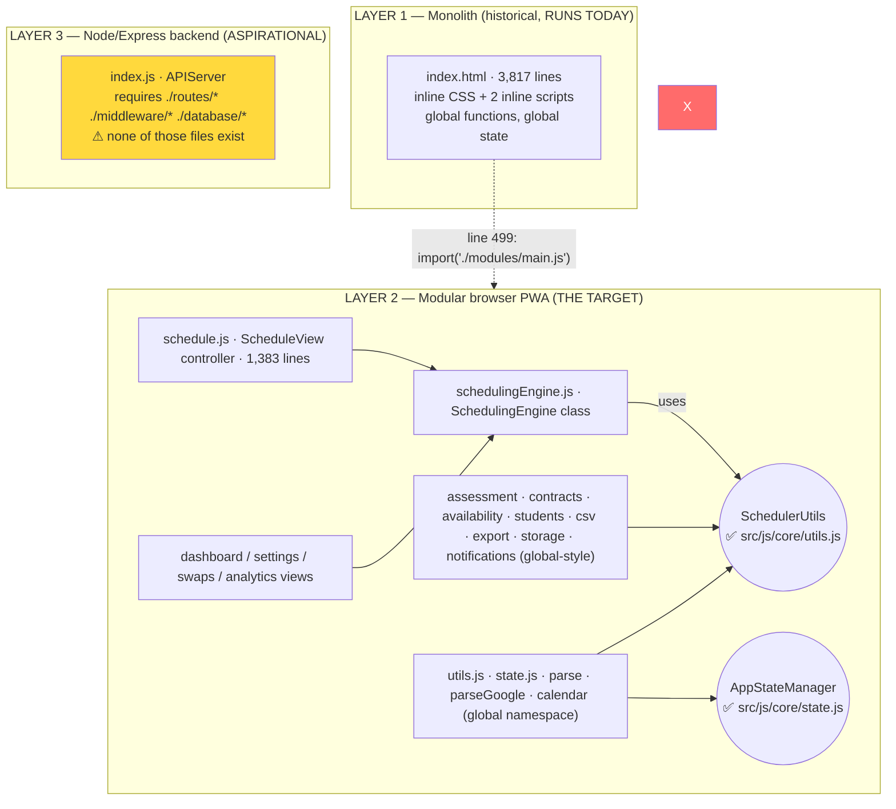

**Implications:**

- **Layer 1** is self-contained and works. It is your source of functional truth.
- **Layer 2** is the product, but it is wired through a missing keystone (`SchedulerUtils`) and has no loader. It is *internally* well-structured but *externally* unassembled.
- **Layer 3** (`index.js`, `schema.sql`, `setup.js`, `api.js`) references `./routes/auth`, `./middleware/auth`, `./database/manager` — directories that **do not exist** in the tree. This is scaffolding for the future SaaS, not running code. It should be **quarantined** into a `server/` folder so it stops looking like part of the shippable PWA (see §12).

`package.json` confirms the aspiration/reality gap: `"main": "src/js/app.js"`, `"start": "node server/index.js"`, `"build:js": "webpack"` — but the actual files are **flat** (no `src/`, no `server/`, no `database/`), modules mostly use `window.X =` globals (not webpack-friendly ESM), and `"test": "jest"` runs against **zero** test files.

## 2.2 Current scheduler architecture (the engine itself)

Within Layer 2, `SchedulingEngine` is genuinely well-designed. Its lifecycle:

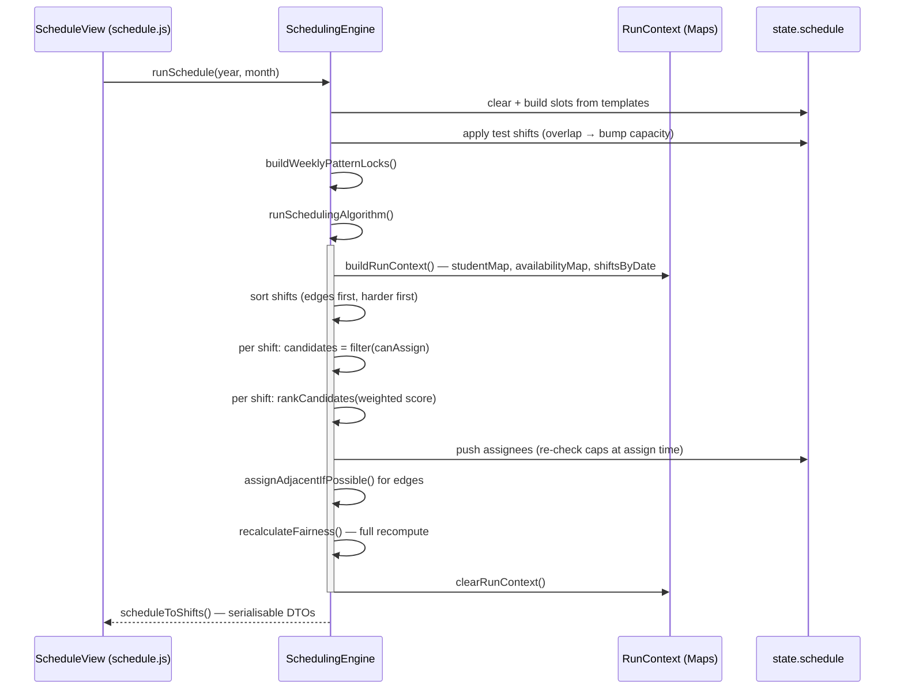

The **RunContext pattern** (`buildRunContext` / `clearRunContext`, lines 81–112) is the single best architectural decision in the codebase: it materialises `studentMap` (O(1) lookup), `availabilityMap` (parse-once), and `shiftsByDate` (bucketed) for the duration of a run, then tears them down. This is exactly the right shape for the performance problems the template's §5 worries about — and the monolith *lacks* it entirely.

## 2.3 Design strengths

1. **Separation of compute from presentation.** The engine returns plain DTOs via `scheduleToShifts()`; it never touches the DOM. The monolith interleaves `renderCalendar()` calls into scheduling logic (e.g. `runSchedule` calls `renderCalendar` mid-function). The engine is therefore unit-testable in Node — which is *how this review was produced*.
2. **Idempotent fairness.** `recalculateFairness()` recomputes openings/closings from the ground-truth schedule after every mutation pass. This structurally eliminates the monolith's fairness-drift class of bug (see §3.4).
3. **Bounded recursion.** The `skipExtension` flag on `canAssignStudentToShift` breaks the monolith's mutual recursion (see §3.5).
4. **Timezone-correct intent.** Every previous-day computation uses `localDateStr`, not `toISOString().slice(0,10)` — the correct fix for the monolith's UTC bug (see §3.3), *pending* the missing util.
5. **Normalisation at the boundary.** `normalizeStudent` / `normalizeShiftInPlace` coerce ragged inputs (string vs number IDs, missing `maxCapacity`) into a consistent shape.
6. **Weighted, explainable scoring.** `SCORE_WEIGHTS` makes candidate selection a tunable linear model rather than a tower of nested comparators (the monolith's `sort` has seven tie-break levels inline).

## 2.4 Coupling analysis

Coupling is **moderate within the engine, dangerous at the namespace boundary.**

| Coupling type | Where | Severity | Note |
|---|---|---|---|
| **Global namespace (implicit)** | `SchedulerUtils`, `AssessmentManager`, `ContractManager`, `SchedulerExport`, `StorageManager`, `NotificationManager` referenced as ambient globals | **High** | No imports; load-order-dependent; one missing global = total failure. This is what makes the project non-runnable. |
| **Two module systems** | ESM (`export`/`import`) in `utils/state/parse/parseGoogle/calendar`; globals (`window.X=`) in the other 19 | **High** | `utils.js` exports `parseTimeStr` as an ESM binding; consumers expect `SchedulerUtils.parseTimeStr`. These never meet. |
| **Engine ↔ Managers** | `AssessmentManager.testsForDate`, `ContractManager.getContractDeficitNorm` called directly | Medium | Acceptable, but should be injected (DI) for testability rather than referenced globally. |
| **Controller ↔ Engine** | `schedule.js` reaches into `engine.state.schedule[...]` directly (lines 357–365, 573) | Medium | Controller depends on engine internals, not just its public DTO surface. Encapsulation leak. |
| **Shared mutable `state`** | Engine and views both mutate the same `state` object | Medium | Works, but no single owner; race-prone once async storage/network is added (§9.4). |

**Diagram — dependency reality vs intent:**

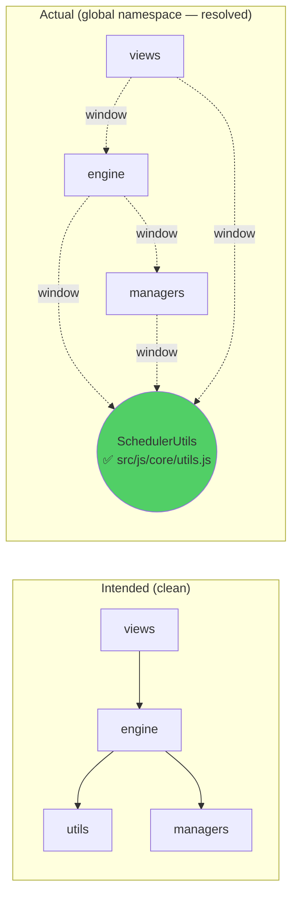

## 2.5 Cohesion analysis

Cohesion is **good in the engine, poor in the controller.**

- `SchedulingEngine` is **functionally cohesive**: every method serves "produce/validate a schedule." ~1,176 lines is large for one class but every member earns its place. Candidate split (later, not now): `ScoringModel`, `ConstraintChecker`, `RebalanceStrategy` as injected collaborators (§7, §12).
- `schedule.js` (1,383 lines) is **logically/coincidentally cohesive**: it mixes DOM rendering, event wiring, modal management, CSV glue, and direct engine-state pokes. This is the next god-file to break up (§10 Phase 3).
- `settings.js` (710), `swaps.js` (766), `analytics.js` (493) are large view controllers — acceptable for now, flagged for later extraction of their non-DOM logic.

## 2.6 SOLID compliance

| Principle | Engine | Codebase | Evidence / fix |
|---|---|---|---|
| **S**ingle responsibility | ⚠ Partial | ✗ `schedule.js` | Engine does compute only (good); controller does five things (§2.5). |
| **O**pen/closed | ⚠ Partial | ⚠ | Scoring is data-driven (`SCORE_WEIGHTS`) — extensible. Rebalance strategy is hard-coded — not. Make it a strategy object (§7.4). |
| **L**iskov | n/a | n/a | Little inheritance; not a concern. |
| **I**nterface segregation | ✗ | ✗ | Controller depends on `engine.state` internals, not a narrow port. Define `ISchedulerPort` (§13.6). |
| **D**ependency inversion | ✗ | ✗ | Everything depends on *concrete globals*. No injection. This is the root cause of both the boot failure and the untestability. Invert via a small DI container or explicit constructor params (§13.6). |

## 2.7 Maintainability assessment

- **Strengths:** the engine is readable, the planning docs are unusually thorough, naming is consistent (`getX`, `isX`, `canX`).
- **Liabilities:** (1) no tests → every refactor is blind; (2) ambient globals → "go to definition" fails, onboarding is hard; (3) two god-files; (4) duplicated logic between monolith and engine that will drift (the SSD rebalance already has).
- **Maintainability index (qualitative):** engine ≈ B+, controller ≈ C, overall ≈ C+. The fastest maintainability win is **tests**, not restructuring — tests make all later restructuring cheap and safe, which is the sequencing you already articulated ("correctness before structure").

---

# 3. Critical Bugs (P0)

> **Framing reminder.** For each bug I state explicitly whether it lives in the **monolith only** (acceptable, must not migrate), the **modular engine** (must fix before daily use), or **both**. This is the bug-containment ledger.

---

## 3.1 P0-1 — Boot blocker: `SchedulerUtils` is undefined (modular engine)

**Location:** `schedulingEngine.js:6` (`this.u = SchedulerUtils;`) plus 50 further references across `schedulingEngine.js`, `students.js`, `availability.js`, `schedule.js`.

**Description.** The engine and four other modules reference a global object `SchedulerUtils` with methods `parseTimeStr`, `timeStr`, `dateISO`, `localDateStr`, `stableColor`, `overlap`, `weekIndexInMonth`. That object is **defined nowhere**. `utils.js` exports the same *functions* but as **ES-module bindings** (`export function parseTimeStr…`), not as a `SchedulerUtils` namespace — and the consumers are global-style scripts, not ESM importers. The two never connect.

**Root cause.** A half-completed module-system migration. During extraction, utilities were written as ESM (`utils.js`) but the engine and managers were written in the global IIFE style and *assume* a `window.SchedulerUtils` that was planned but never created.

**Why it occurs.** Load order is irrelevant — there is no definition at any point. Even with perfect ordering, the symbol is absent.

**Example execution path.**
1. Page loads modular scripts (today: it can't, because no loader HTML exists — but assume one).
2. `new SchedulingEngine(state, logger)` runs the constructor.
3. Constructor body: `this.u = SchedulerUtils;` → dereference of an undeclared identifier → `ReferenceError`.

**Stack trace simulation (from the harness, verbatim):**
```
[CLAIM 1] Engine WITHOUT SchedulerUtils => ReferenceError: SchedulerUtils is not defined
    at new SchedulingEngine (schedulingEngine.js:6:14)
    at Object.<anonymous> (harness.js:.. )
```
(In a browser the same throws at first construction; in strict-mode ESM it would be a `ReferenceError` at parse/first-use.)

**Business impact.** **Total.** The modular PWA — the intended daily product — cannot initialise. Every downstream feature (calendar render, assignment, rebalance, swap marketplace) is dead behind this one missing symbol. This is why the project, despite an excellent engine, scores 1.0 on runnability.

**Risk assessment.** Likelihood: certain. Impact: critical. **This is the single highest-priority item in the entire review.**

**Recommended solution.** Create `utils.js` as a **global namespace** (matching the consumers), or add a thin adapter. Minimal correct implementation (this is the exact surface the harness used to make the engine run):

**Before** (`utils.js`, ESM — invisible to global consumers):
```javascript
export function pad(n){ return n.toString().padStart(2,'0'); }
export function parseTimeStr(t){ const [h,m]=t.split(':').map(Number); return h*60+m; }
export function dateISO(y,m,d){ return `${y}-${pad(m+1)}-${pad(d)}`; }
export function overlap(a1,a2,b1,b2){ return Math.max(a1,b1) < Math.min(a2,b2); }
```

**After** (`utils.js`, global namespace — what every consumer expects):
```javascript
const SchedulerUtils = (() => {
  const pad = n => String(n).padStart(2, '0');
  return {
    pad,
    parseTimeStr(t) {
      const [h, m] = String(t).split(':').map(Number);
      return h * 60 + m;
    },
    // wrap negatives/overflow so 06:30 minus 60 → 05:30, not -:30
    timeStr(mins) {
      const h = Math.floor((((mins % 1440) + 1440) % 1440) / 60);
      const m = (((mins % 60) + 60) % 60);
      return pad(h) + ':' + pad(m);
    },
    dateISO(y, m, d) { return `${y}-${pad(m + 1)}-${pad(d)}`; },
    // LOCAL date string — the timezone-correct replacement for toISOString().slice(0,10)
    localDateStr(date) {
      return `${date.getFullYear()}-${pad(date.getMonth() + 1)}-${pad(date.getDate())}`;
    },
    overlap(a1, a2, b1, b2) { return Math.max(a1, b1) < Math.min(a2, b2); },
    stableColor(seed) {
      let h = 0;
      for (const c of String(seed)) h = (h * 31 + c.charCodeAt(0)) >>> 0;
      const hue = h % 360;
      return `hsl(${hue} 70% 55%)`;
    },
    // week index within the month, Sunday-start (matches engine's getWeekStart)
    weekIndexInMonth(dateStr) {
      const d = new Date(dateStr + 'T00:00:00');
      const monthStart = new Date(d.getFullYear(), d.getMonth(), 1);
      const dayIndex = Math.floor((d - monthStart) / 86400000);
      return Math.floor((dayIndex + monthStart.getDay()) / 7);
    }
  };
})();
if (typeof window !== 'undefined') window.SchedulerUtils = SchedulerUtils;
if (typeof module !== 'undefined') module.exports = SchedulerUtils; // for Node tests
```

**Unit tests to add** (Vitest/Jest):
```javascript
import U from '../utils.js';
test('parseTimeStr round-trips', () => {
  expect(U.parseTimeStr('06:30')).toBe(390);
  expect(U.timeStr(390)).toBe('06:30');
});
test('timeStr handles underflow (opening minus 1h)', () => {
  expect(U.timeStr(U.parseTimeStr('06:30') - 60)).toBe('05:30'); // not "-1:30"
});
test('localDateStr is timezone-stable', () => {
  // 2025-10-15 local, minus 1 day, must be 2025-10-14 in ANY tz
  const d = new Date('2025-10-15T00:00:00'); d.setDate(d.getDate() - 1);
  expect(U.localDateStr(d)).toBe('2025-10-14');
});
test('dateISO pads month/day', () => {
  expect(U.dateISO(2025, 0, 5)).toBe('2025-01-05');
});
```

---

## 3.2 P0-2 — Two incompatible module systems (codebase)

**Location:** project-wide. ESM: `utils.js`, `state.js`, `parse.js`, `parseGoogle.js`, `calendar.js`, `main.js`. Global: the other 19 `.js`.

**Description.** Mixing `export`/`import` with `window.X =` in scripts loaded the same way cannot work. ESM files must be loaded as `<script type="module">` and expose nothing globally; global files must be plain `<script>` and expose via `window`. A single page cannot satisfy both for cross-references like "global engine uses ESM util."

**Root cause.** Incremental extraction without committing to one target module format. `main.js` even admits it: *"inline init remains authoritative for now."*

**Why it occurs.** `import { dateISO } from './utils.js'` in `main.js` works *only* inside a module; `SchedulerUtils.dateISO` in `schedulingEngine.js` works *only* if a global exists. Both styles are present, so at least one set of references is always broken.

**Example execution path.** Load `schedulingEngine.js` as a classic script → it needs global `SchedulerUtils` → ESM `utils.js` never created one → ReferenceError (this is the mechanism behind P0-1).

**Business impact.** High. Guarantees the boot blocker, makes the future webpack build (`build:js`) fail, and confuses every contributor about "where is this function."

**Risk assessment.** Likelihood: certain (already manifest). Impact: critical (root cause of non-runnability).

**Recommended solution.** **Pick one. For a client-only PWA with no build step today, choose the global namespace** (lowest friction, matches the 19 majority files). Convert the 5 ESM files to global style and load everything as ordered classic scripts (loader in §3.6 / §12). Migrate to ESM + bundler *later*, as one deliberate step, once tests exist.

**Decision tree:**
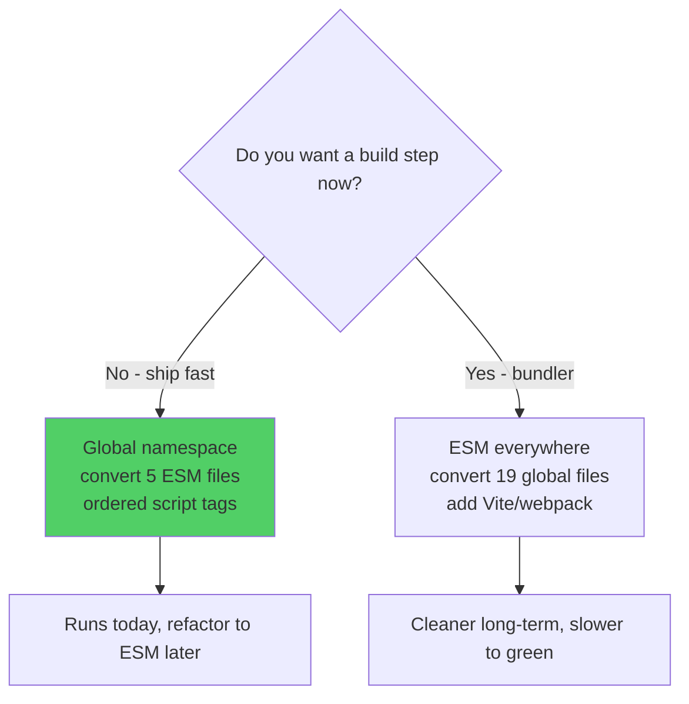

**Test to add:** a "boot smoke test" that loads every module in order under jsdom and asserts `window.SchedulingEngine`, `window.ScheduleView`, etc. are all defined (catches future namespace regressions).

---

## 3.3 P0-3 — UTC date bug in previous-day / weekly-window math (monolith only — **fixed in engine, pending util**)

**Location (monolith):** `index.html:2518`, `2556`, `3179` (`prev.toISOString().slice(0,10)`); `index.html:1259` (`checkDate.toISOString().split('T')[0]` inside `getWeeklyAssignedHours`).

**Description.** The monolith builds a *local-midnight* Date (`new Date(dateStr + 'T00:00:00')`), subtracts a day, then serialises with `toISOString()`, which converts to **UTC**. In SAST (UTC+2 — the timezone you actually run in) local midnight is 22:00 UTC of the *previous* day, so `toISOString().slice(0,10)` yields a date **one day too early**. For the previous-day edge check this means it inspects **two days back** instead of one.

**Root cause.** `toISOString()` is always UTC; using it to derive a *calendar date* is only safe at UTC+0. Classic timezone footgun.

**Why it occurs.** Every developer testing near UTC+0 sees correct results; the bug is invisible until you run east of Greenwich — which is exactly your situation.

**Example execution path + stack trace simulation (harness, verbatim, TZ=Africa/Johannesburg):**
```
[CLAIM 3] Previous-day computation under SAST (UTC+2):
  2025-10-15: monolith(toISOString)=2025-10-13  modular(localDateStr)=2025-10-14  expected=2025-10-14
  2025-09-22: monolith(toISOString)=2025-09-20  modular(localDateStr)=2025-09-21  expected=2025-09-21

[CLAIM 4] Weekly 7-day window keys for 2025-10-15 (Wed):
  monolith: 2025-10-11 2025-10-12 2025-10-13 2025-10-14 2025-10-15 2025-10-16 2025-10-17
  modular : 2025-10-12 2025-10-13 2025-10-14 2025-10-15 2025-10-16 2025-10-17 2025-10-18
```

Two concrete failures:
1. **Consecutive-edge rule** (`didEdge(prevKey,…)`) checks Oct 13 instead of Oct 14 → the "no opening two days running" guard silently inspects the wrong day → students *can* be assigned back-to-back openings the rule was meant to prevent.
2. **Weekly hours** (`getWeeklyAssignedHours`) sums over Oct 11–17 instead of the correct Sun–Sat Oct 12–18 → the weekly-cap check uses a window shifted by one day → caps are enforced against the wrong week, both over- and under-counting at the boundaries.

**Business impact.** Medium-High *in the monolith you use daily*: weekly-cap enforcement and fairness-edge spacing are quietly wrong for every schedule you have generated in SAST. It has not been catastrophic because the errors are at week boundaries and the openings rule is a soft preference, but it means **some real schedules violated intended weekly limits or doubled-up openings without warning.**

**Containment status.** ✅ **The modular engine already fixes this** — it uses `this.u.localDateStr(...)` everywhere (lines 306, 564, 871, 965). The fix is correct *once `SchedulerUtils.localDateStr` exists* (P0-1). **Do not port the monolith's `toISOString` pattern.**

**Recommended solution (if you ever patch the monolith too):**

**Before:**
```javascript
const prevKey = prevDate.toISOString().slice(0,10);            // UTC — wrong in SAST
const dateKey = checkDate.toISOString().split('T')[0];          // UTC — wrong in SAST
```
**After:**
```javascript
const pad = n => String(n).padStart(2,'0');
const localDateStr = d => `${d.getFullYear()}-${pad(d.getMonth()+1)}-${pad(d.getDate())}`;
const prevKey = localDateStr(prevDate);                         // local — correct everywhere
const dateKey = localDateStr(checkDate);
```

**Unit tests to add:**
```javascript
test('previous-day edge key is local, not UTC', () => {
  process.env.TZ = 'Africa/Johannesburg';
  const prev = new Date('2025-10-15T00:00:00'); prev.setDate(prev.getDate()-1);
  expect(U.localDateStr(prev)).toBe('2025-10-14'); // monolith would give 2025-10-13
});
test('weekly window covers Sun..Sat in local tz', () => {
  const keys = engine._debugWeekKeys('2025-10-15'); // helper exposing the 7 keys
  expect(keys[0]).toBe('2025-10-12');
  expect(keys[6]).toBe('2025-10-18');
});
```

---

## 3.4 P0-4 — Fairness corruption via incremental updates (monolith only — **fixed in engine**)

**Location (monolith):** `index.html:2568–2569`, `2847–2848` (increment on assign / auto-extend), `3258–3263` (decrement on rebalance swap). The `added` and `pair` rebalance branches (`3204`, `3237`) mutate assignees **without** touching fairness.

**Description.** The monolith maintains `state.fairness[id] = {openings, closings}` by **incrementally** `++`-ing and `--`-ing across many code paths. Several mutation paths update assignees but not fairness (the rebalance "add" and "pair" branches), and `assignAdjacentIfPossible` increments fairness for a neighbour that is rarely actually an edge. Over a full run + fill + rebalance cycle, `state.fairness` **drifts out of sync** with the real schedule.

**Root cause.** Derived state (fairness) maintained by hand at every mutation site, with no single recompute. Any missed site corrupts the invariant `fairness == count(edges in schedule)`.

**Why it occurs.** Adds happen in `runSchedulingAlgorithm`, `assignAdjacentIfPossible`, `fillOpenClose`, and three branches of `rebalance`; only some update fairness. The fairness *score* then feeds back into ranking and rebalance decisions, so the corruption compounds.

**Example execution path.**
1. Run schedule → openings counted (mostly) correctly.
2. `rebalance()` moves an opening from A to B via the **`added`** branch (capacity was free) → B now opens, but `fairness[B].openings` is **not** incremented.
3. Next iteration's `getFairnessScore(B)` under-counts B → ranking believes B is "more fair than reality" → B keeps getting edges → real-world opening load skews to B while the UI's fairness numbers look balanced.

**Business impact.** Medium: the fairness the tool *reports* and the fairness it *optimises against* diverge from the fairness students actually experience. Undermines the core value proposition ("fair distribution").

**Containment status.** ✅ **Fixed in engine.** Every engine pass ends with `recalculateFairness()` (lines 458–473), a full recompute from `schedule` ground truth. The harness shows balanced, consistent fairness/hours (36–42h) with no drift. **Do not port incremental fairness bookkeeping.**

**Before (monolith, representative):**
```javascript
// scattered, partial:
if (shift.isOpening) state.fairness[student.id].openings++;     // in runSchedulingAlgorithm
// ... but the rebalance 'added' branch just does:
s.assignees.push(lo.id); reasons.added++;                       // fairness NOT updated → drift
```
**After (engine, correct):**
```javascript
// any number of mutation passes, then ONE source of truth:
recalculateFairness() {
  this.state.fairness = {};
  for (const st of this.state.students) this.state.fairness[st.id] = { openings: 0, closings: 0 };
  for (const shift of this.getShiftList()) {
    if (!shift.assignees?.length) continue;
    shift.assignees.forEach(sid => {
      this.state.fairness[sid] ??= { openings: 0, closings: 0 };
      if (shift.isOpening) this.state.fairness[sid].openings++;
      if (shift.isClosing) this.state.fairness[sid].closings++;
    });
  }
}
```

**Unit test to add:**
```javascript
test('fairness equals recomputed edges after run+rebalance', () => {
  engine.runSchedule(2025, 8); engine.rebalance();
  const reported = JSON.stringify(engine.state.fairness);
  engine.recalculateFairness();
  expect(JSON.stringify(engine.state.fairness)).toBe(reported); // invariant holds
});
```

---

## 3.5 P0-5 — Opening/closing mutual recursion (monolith only — **fixed in engine**)

**Location (monolith):** `canAssignStudentToShift` (`index.html:1242`) calls `canExtendTwoHours`; `canExtendTwoHours` (`2801–2802`) calls `canAssignStudentToShift` on neighbour slots — with **no guard**.

**Description.** `canAssign(edge)` → `canExtendTwoHours(edge)` → `canAssign(neighbour)` → if the neighbour is *also* an edge, `canExtendTwoHours(neighbour)` → `canAssign(edge)` → … **infinite mutual recursion → stack overflow.**

**Root cause.** Two functions that each call the other, with the recursion-terminating condition ("don't re-check extension on the neighbour") never expressed.

**Why it occurs.** With the *default* templates only hour 6 (opening) and hour 17 (closing) are edges, and their neighbours (07:30, 16:30) are non-edges, so recursion bottoms out at depth 2 and you never see the crash. **But** the early-opening feature (`suggestEarlyOpeningForLargeTests`, `isEarlyOpening`) and test-shift slot creation can produce **two adjacent edge slots** (e.g. an early opening at 05:30 *and* the normal opening at 06:30). Then the recursion has no floor.

**Example execution path (the crashing one).**
1. A large test triggers `suggestEarlyOpeningForLargeTests` → an extra opening slot at 05:30–06:30 is created adjacent to the 06:30 opening, both flagged `isOpening`.
2. `canAssign(06:30 opening)` → `canExtendTwoHours(06:30)` checks neighbour `05:30` → `canAssign(05:30 opening)` → `canExtendTwoHours(05:30)` checks neighbour `06:30` → `canAssign(06:30)` → …
3. `Maximum call stack size exceeded`.

**Business impact.** Low-frequency, high-severity in the monolith: a hang/crash precisely when scheduling a *large exam day* — the highest-stakes scenario.

**Containment status.** ✅ **Fixed in engine** via the `skipExtension` parameter: `canExtendTwoHours` calls `canAssignStudentToShift(sid, neighbour, /*skipExtension=*/true)` (lines 637, 652), and `canAssignStudentToShift` skips the extension check when `skipExtension` is set (line 414). Recursion depth is bounded to 1. **Do not port the unguarded version.**

**Before (monolith):**
```javascript
function canAssignStudentToShift(id, shift){
  // ...
  if ((shift.isOpening||shift.isClosing) && !canExtendTwoHours(id, shift)) return false; // recurses
}
function canExtendTwoHours(id, ...){
  const canBefore = before && validateAssignment(id,before).length===0 && canAssignStudentToShift(id, before); // re-enters
}
```
**After (engine):**
```javascript
canAssignStudentToShift(studentId, shift, skipExtension = false) {
  // ...
  if (!skipExtension && (shift.isOpening || shift.isClosing) && !this.canExtendTwoHours(studentId, shift))
    return false;
}
canExtendTwoHours(studentId, ...) {
  const canBefore = before
    && this.validateAssignment(sid, before).length === 0
    && this.canAssignStudentToShift(sid, before, /* skipExtension */ true); // bounded
}
```

**Unit test to add:**
```javascript
test('adjacent edge slots do not cause stack overflow', () => {
  // craft 05:30 + 06:30 both isOpening, then probe canAssign
  setupAdjacentOpenings(engine);
  expect(() => engine.canAssignStudentToShift('1', engine.state.schedule['2025-09-22 06:30'])).not.toThrow();
});
```

---

## 3.6 P0-6 — Capacity violations on required-1 slots (both — **handled in engine, verify**)

**Location:** monolith `canAssignStudentToShift:1210` (`maxCapacity = shift.maxCapacity || shift.required`); your working-copy "Fix B" removed a `Math.max(slot.required, 2)` over-capacity bug from the seed pass.

**Description.** Per your own notes, an earlier monolith seed pass used `Math.max(slot.required, 2)`, allowing **two** assignees on a `required:1` slot → over-staffing. The current `index.html` no longer contains that expression (so Fix B, or an equivalent, is present in this copy), but the **modular engine must be confirmed never to reintroduce it**.

**Containment status.** ✅ The engine centralises capacity in `getShiftCapacity` = `maxCapacity ?? required ?? 1` and checks it in `canAssignStudentToShift` (line 395), `assignAdjacentIfPossible` (line 680), and `validateSchedule` (line 1061). The harness confirms **zero over-capacity** across 264 slots:
```
slots: 264 | filled(>=required): 199 | over-capacity: 0
```

**Recommended guard (make it impossible to regress):** add an assertion in `validateSchedule` (already present) **and** a dedicated test:
```javascript
test('no required-1 slot ever holds 2 assignees', () => {
  const shifts = engine.runSchedule(2025, 8);
  for (const s of shifts) expect(s.assignees.length).toBeLessThanOrEqual(s.maxCapacity);
});
```

---

## 3.7 P0 summary ledger

| ID | Bug | Monolith | Engine | Action |
|---|---|---|---|---|
| P0-1 | `SchedulerUtils` undefined | — | ✅ **resolved** | `src/js/core/utils.js` — `window.SchedulerUtils` defined (see status update above §1) |
| P0-2 | Two module systems | — | ✅ **resolved** | Global namespace adopted; modular PWA boots |
| P0-3 | UTC date math | ✗ buggy | ✅ fixed | P0-1 resolved; `localDateStr` now reachable |
| P0-4 | Fairness drift | ✗ buggy | ✅ fixed | Don't port |
| P0-5 | Edge recursion | ✗ crash risk | ✅ fixed | Don't port |
| P0-6 | Capacity over-staffing | ✅ fixed here | ✅ fixed | Guard with test |

**Reading:** the engine's *algorithmic* P0s are already solved. The *open* P0s are pure **wiring** (P0-1, P0-2). This is good news — wiring is cheap and mechanical.

---

# 4. Major Logic Bugs (P1)

> These are correctness/semantic issues that will not crash but will produce *wrong or surprising schedules*. Several are **silent behavioural divergences** between monolith and engine — the most dangerous kind for a parity migration, because nobody decided them.

---

## 4.1 P1-1 — Test-day availability semantics changed (divergence — **needs a policy decision**)

**Monolith** (`index.html:2168–2169`, and `2637–2644` for assessment days):
```javascript
if (slotEnd <= testStart){ errs.push('Before student test'); break; }   // blocks shifts ending before the test
if (slotStart < (testEnd + 60)){ errs.push('Within 1h after student test'); break; }
```
**Engine** (`schedulingEngine.js:38–42`):
```javascript
shiftConflictsWithStudentTest(start, end, testStart, testEnd) {
  if (start < testEnd && end > testStart) return true;     // overlap only
  if (start < testEnd + 60 && end > testEnd) return true;  // 1h post-test buffer only
  return false;
}
```

**Visual flow — what each rule blocks for a 14:00–16:00 exam:**
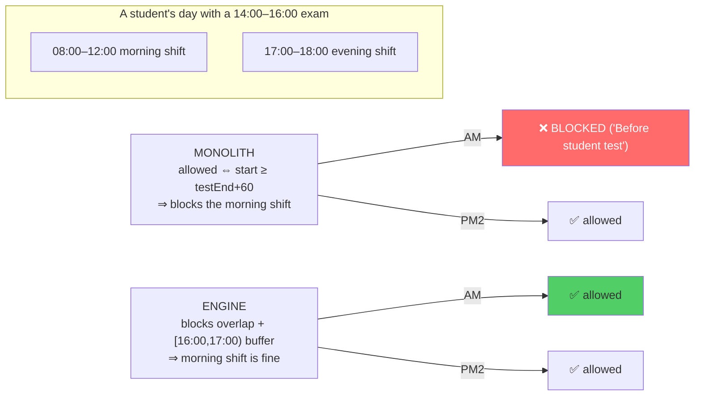

**Explanation.** The monolith effectively permits a student with a test that day to work **only** shifts starting ≥1h after the exam ends — every pre-exam shift is blocked with the (misleading) reason "Before student test." The engine permits everything except the exam overlap and a one-hour decompression buffer, so **pre-exam morning shifts become assignable.**

**Example data.** Eva has a 14:00–16:00 exam on 2025-09-19 (`unavailable_dates`). Monolith: Eva cannot take the 09:00–10:00 slot. Engine: Eva **can**. Same input, opposite scheduling outcome.

**Why this matters.** This is a **student-welfare policy**, not a mechanical detail. If the monolith's restriction was *intentional* ("don't make students work the morning before an exam"), the engine has silently removed a protection and will now schedule pre-exam labour. If it was *accidental over-restriction*, the engine is a genuine fix. **Either way it must be a conscious decision, surfaced and signed off — not a side effect of a rewrite.** (This is exactly the "no silent assumptions" discipline.)

**Correct implementation — make the policy explicit and configurable:**
```javascript
// state.policy.preExamBuffer = { mode: 'overlap-only' | 'no-work-before-exam', postMins: 60 }
shiftConflictsWithStudentTest(start, end, testStart, testEnd, policy = this.state.policy?.preExam) {
  const post = policy?.postMins ?? 60;
  if (start < testEnd && end > testStart) return true;            // always block overlap
  if (start < testEnd + post && end > testEnd) return true;       // always block post buffer
  if (policy?.mode === 'no-work-before-exam' && end <= testStart) // OPT-IN monolith behaviour
    return true;
  return false;
}
```

**Tests to add (both policies):**
```javascript
test('overlap-only: pre-exam morning shift allowed', () => {
  expect(engine.shiftConflictsWithStudentTest(540,600, 840,960, {mode:'overlap-only'})).toBe(false);
});
test('no-work-before-exam: pre-exam morning shift blocked', () => {
  expect(engine.shiftConflictsWithStudentTest(540,600, 840,960, {mode:'no-work-before-exam'})).toBe(true);
});
test('1h post-exam buffer blocked under both policies', () => {
  expect(engine.shiftConflictsWithStudentTest(960,1020, 840,960, {mode:'overlap-only'})).toBe(true);
});
```

---

## 4.2 P1-2 — Weekly-target divisor changed: dynamic weeks → fixed 4.333 (divergence)

**Monolith** (`getWeeklyTargetHours` → `operationalWeeksInMonth`, lines 580–594): divides the monthly contract by the **actual count of operational weeks in the month** (4 or 5, computed from `weekKey` over operational days).
**Engine** (`getWeeklyTargetHours`, lines 31–35): divides by the **constant** `WEEKS_PER_MONTH = 52/12 ≈ 4.333`.

**Explanation.** For a 72h contract:
- Monolith in a 5-operational-week month: target = 72/5 = **14.4 h/week**.
- Engine always: target = 72/4.333 = **16.6 h/week**.

That ~15% difference feeds the `weeklyBalance` score component and (in the monolith) the rebalance under-target bias. The engine will consider students "under target" later and pack weeks more tightly; the monolith spreads thinner across more weeks.

**Example data.** A month with five Mon–Fri working weeks: monolith aims 14.4h/student/week, engine 16.6h. On a 5-week month the engine can legitimately schedule a student to 16.6×5 ≈ 83h *intended* against a 72h contract — the hard monthly cap still clamps it, but the weekly *targets* now over-shoot, biasing the optimiser.

**Correct implementation.** Prefer the monolith's *intent* (respect real weeks) but make it robust and explicit:
```javascript
getWeeklyTargetHours(studentId) {
  const st = this.getStudent(studentId);
  const monthly = st?.contracted_monthly_hours || 72;
  const weeks = this.operationalWeeksInMonth();   // port the monolith helper into the engine
  return weeks > 0 ? Math.max(0, monthly / weeks) : 0;
}
operationalWeeksInMonth() {
  const { year, month } = this.state;
  const days = new Date(year, month + 1, 0).getDate();
  const weeks = new Set();
  for (let d = 1; d <= days; d++) {
    const ds = this.dateISO(year, month, d);
    if (this.isOperationalDay(ds)) weeks.add(this.u.weekIndexInMonth(ds));
  }
  return weeks.size || 4;
}
```

**Test to add:**
```javascript
test('weekly target uses operational week count', () => {
  // Oct 2025 has 5 Mon-Fri weeks → 72/5 not 72/4.333
  engine.state.year = 2025; engine.state.month = 9;
  expect(engine.getWeeklyTargetHours('1')).toBeCloseTo(72/5, 1);
});
```

---

## 4.3 P1-3 — Pattern-lock "first 5-day week" assumption (both — engine partially hardened)

**Monolith** (`buildWeeklyPatternLocks`, lines 2730–2758): finds the first Monday with Mon–Fri in the month and snapshots each student's worked start-times per weekday as a "lock." It does **not** verify those days are *operational* (could be a batch holiday) — so a holiday-laden first week yields empty/garbage locks.
**Engine** (lines 687–735): improved — it requires the candidate week to be **fully operational** (`isOperationalDay` for all five days) before locking, and logs when no such week exists.

**Explanation.** The remaining issue (both): the *concept* assumes a representative first week exists and that patterns should propagate from it. In months that **start mid-week** or whose first full week overlaps a batch holiday or assessment period, the lock is either empty (engine) or wrong (monolith), silently weakening the consistency objective for the whole month.

**Example data.** A month where the first Mon–Fri week is an exam week (assessment period): engine finds no fully-operational week → returns `{}` → **zero** pattern-lock bias all month → consistency degrades to whatever the greedy pass happens to do.

**Correct implementation.** Generalise from "first week" to "most representative operational week," or accumulate locks across the first *two* operational weeks:
```javascript
buildWeeklyPatternLocks() {
  const weeks = this.firstNOperationalWeeks(2);     // robustness: look at up to 2 weeks
  if (!weeks.length) { this.log('No operational week for pattern locks'); return {}; }
  const locks = {};
  for (const wk of weeks) for (const ds of wk) {
    for (const s of this.getShiftsByDate(ds)) {
      const dow = new Date(ds + 'T00:00:00').getDay();
      if (dow === 0 || dow === 6) continue;
      s.assignees.forEach(sid => {
        ((locks[sid] ??= {})[dow] ??= new Set()).add(s.start);
      });
    }
  }
  // freeze sets → arrays
  for (const sid in locks) for (const d in locks[sid]) locks[sid][d] = [...locks[sid][d]];
  return locks;
}
```

**Test to add:**
```javascript
test('pattern locks survive an exam-week first week', () => {
  addAssessmentPeriod(engine, '2025-10-06', '2025-10-10'); // first full week
  engine.runSchedule(2025, 9);
  expect(Object.keys(engine.state.patternLocks).length).toBeGreaterThan(0);
});
```

---

## 4.4 P1-4 — Chain logic + the dropped rebalance passes (regression vs your own best work)

**Two related issues.**

**(a) Chain scoring is duplicated, not shared.** `getChainPreferenceScore` exists in both monolith (2763–2783) and engine (475–483) with identical maths (peak at 2–5h, −5 for isolated 1h, −100 for >5h). Fine — but it is **copy-pasted**, so any tuning must be done twice and *will* drift (the SSD rebalance already drifted; see (b)). Extract one `ChainModel`.

**(b) The engine's `rebalance` silently dropped two passes and the SSD rewrite.** The monolith's `rebalance` (3088–3297) runs **four** escalating `trySwap` passes and a **pair (two-slot) transfer**:
```javascript
moved = trySwap(consistency-preserving non-edge);
if (!moved) moved = trySwap(non-edge);
if (!moved) moved = trySwap(consistency-preserving edge);
if (!moved) moved = trySwap(anything);
// plus tryPair(): move an adjacent hour pair together
```
The engine's `rebalance` (892–1010) runs **two** passes and **no pair transfer**:
```javascript
moved = trySwap(s => !(s.isOpening || s.isClosing));
if (!moved) moved = trySwap();
```
**And** — critically — neither version uses the **SSD-decrease, inequality-gated** algorithm you developed in your monolith working copy ("Fix C"), which has a *provable* termination guarantee. Both shipped versions use the **non-convergent max–min gap heuristic** (`targetGap = 5`, `iterations < 200`).

**Visual flow — the regression:**
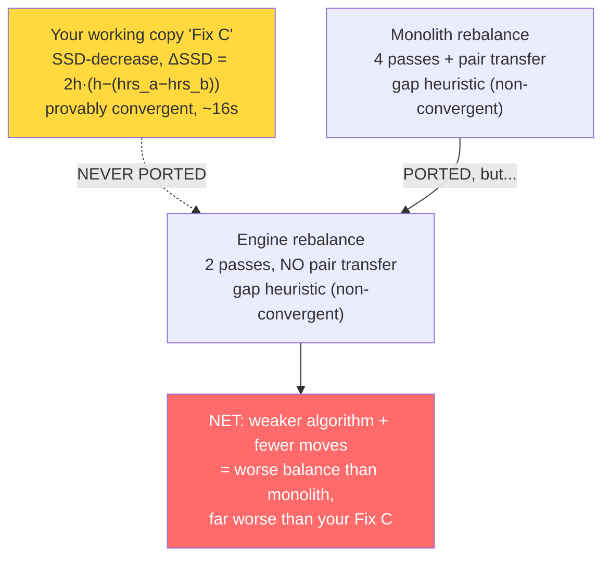

**Explanation / impact.** The engine's rebalance can (i) leave hours less balanced than the monolith (fewer move types), and (ii) like the monolith, **oscillate** — move A→B then B→A across iterations — terminating only at the 200-iteration cap or a no-move stall, **without a guarantee of reaching the constraint-limited optimum.** Your Fix C fixes exactly this with a strict monotonic decrease in sum-of-squared-deviations.

**Correct implementation.** Port Fix C into the engine as a strategy (full version in §7.4 and the Refactoring Guide). The gating inequality you derived:
> A swap of one shift of length *h* from student *a* (hours `H_a`) to student *b* (hours `H_b`) strictly decreases SSD **iff** `H_a − H_b > h`, with `ΔSSD = 2h·(h − (H_a − H_b)) < 0`. Each accepted swap strictly reduces a bounded-below integer-ish quantity ⇒ the loop **terminates** at a local optimum where no inequality-satisfying swap remains.

Restore the pair-transfer and the consistency-preserving pass on top.

**Tests to add:**
```javascript
test('rebalance strictly decreases SSD and terminates', () => {
  engine.runSchedule(2025, 8);
  const ssd = () => { const h = studentsHours(engine); const m = mean(h); return sum(h.map(x => (x-m)**2)); };
  const before = ssd();
  engine.rebalance();
  expect(ssd()).toBeLessThanOrEqual(before);          // monotone
  // and: no remaining swap satisfies H_a - H_b > shiftLen (optimality witness)
  expect(hasImprovingSwap(engine)).toBe(false);
});
test('rebalance still performs pair transfers when single swaps blocked', () => {
  setupPairOnlyScenario(engine);
  const moved = engine.rebalance();
  expect(countPairMoves(engine.log)).toBeGreaterThan(0);
});
```

---

## 4.5 P1-5 — Monthly-target application & the 72h cap (both)

**Location:** monolith `applyMonthlyTargetToAll` (2884–2895) caps at 72h; `ContractManager.MAX_HOURS = 72`. The engine reads `contracted_monthly_hours` but `normalizeStudent` defaults a *missing* monthly to `weeklyMax * 4` (line 47), **not** to 72 and **not** via `ContractManager`.

**Explanation.** Three different defaulting rules coexist: monolith CSV import defaults monthly to `0` (then treated as "no cap"), `applyMonthlyTargetToAll` caps at 72, engine `normalizeStudent` defaults to `weeklyMax*4` (e.g. 18×4 = 72, but 12×4 = 48, 10×4 = 40). So a student imported with no monthly contract gets a **different** effective cap depending on which path touched them. The harness data shows this: Bob (weeklyMax 12) → 48h cap, Eva (10) → 40h, Diego/Alice (18) → 72h — internally consistent *for the sample*, but only because the sample specified monthly hours.

**Example data.** Import a student with `weekly_max_hours=15` and **blank** `contracted_monthly_hours`:
- Monolith: monthly = 0 → no monthly cap → can be scheduled to the weekly cap every week (≈65h).
- Engine: monthly = 15×4 = 60 → capped at 60h.
Same CSV row, 5h+ difference in monthly ceiling.

**Correct implementation.** Single source of truth via `ContractManager`:
```javascript
normalizeStudent(raw) {
  const weeklyMax = Number(raw.weekly_max_hours ?? 18) || 18;
  const monthly = (raw.contracted_monthly_hours != null && raw.contracted_monthly_hours !== '')
    ? ContractManager.validateHours(raw.contracted_monthly_hours)   // clamps to [1,72]
    : ContractManager.defaultMonthlyFor(weeklyMax);                  // ONE documented rule
  return { ...raw, weekly_max_hours: weeklyMax, contracted_monthly_hours: monthly, /* ... */ };
}
```

**Test to add:**
```javascript
test('blank monthly contract resolves identically everywhere', () => {
  const s = engine.normalizeStudent({ id:'x', weekly_max_hours:15 });
  expect(s.contracted_monthly_hours).toBe(ContractManager.defaultMonthlyFor(15));
});
```

---

## 4.6 P1-6 — Time-overlap & adjacency edge cases (both)

**Location:** overlap test `start < end && end > start` is used consistently (good), but **adjacency** (`adjacentSlotKey`, `assignAdjacentIfPossible`) assumes a uniform **60-minute grid**. `state.granularity` exists (30/60), and templates *could* be non-hourly, but the adjacency math hard-codes `±60`.

**Explanation.** If granularity is 30 or templates are 90-minute, `adjacentSlotKey(date, start, -60)` looks for a slot exactly 60 minutes earlier, which may not exist, so auto-extend silently no-ops and edge shifts under-fill. The overlap check itself is correct; the *grid assumption* is the latent bug.

**Example data.** Set `granularity = 30` with half-hour templates: an opening at 06:30–07:00, neighbour at 07:00–07:30. `assignAdjacentIfPossible` looks for `${date} 06:30`'s neighbour via `shift.end` = "07:00" (correct next) but the *prev* via `-60` = 05:30, missing the real 06:00 neighbour. Auto-extend misbehaves.

**Correct implementation.** Derive the step from the shift, not a constant:
```javascript
adjacentSlotKey(dateStr, startTime, direction = -1) {
  const step = this.state.granularity || 60;
  const mins = this.parseTimeStr(startTime) + direction * step;
  if (mins < 0 || mins >= 1440) return null;
  return `${dateStr} ${this.timeStr(mins)}`;
}
```
…and compute the previous neighbour from the *neighbour's* duration where slots are non-uniform.

**Test to add:**
```javascript
test('adjacency respects 30-min granularity', () => {
  engine.state.granularity = 30;
  expect(engine.adjacentSlotKey('2025-09-22','07:00',-1)).toBe('2025-09-22 06:30');
});
```

---

## 4.7 P1 summary ledger

| ID | Issue | Type | Monolith | Engine | Priority |
|---|---|---|---|---|---|
| P1-1 | Test-day availability semantics | **Divergence** | restrictive | permissive | **Decide & document** |
| P1-2 | Weekly-target divisor | Divergence | dynamic weeks | fixed 4.333 | High |
| P1-3 | Pattern-lock first-week assumption | Weakness | worse | hardened | Medium |
| P1-4 | Rebalance dropped passes + no SSD | **Regression** | 4 passes+pair | 2 passes | **High** |
| P1-5 | Monthly default rule | Divergence | three rules | own rule | Medium |
| P1-6 | 60-min grid assumption | Latent | latent | latent | Low-Med |


# 5. Performance Review

## 5.1 Measured baseline

From the harness (5 students, full September, 264 hourly slots), under Node on a normal laptop:

```
[CLAIM 2] Engine WITH SchedulerUtils => ran in 297 ms
```

297 ms for a 5-student month is *fine for daily use* but will not stay fine: cost scales roughly with **students × slots × (per-check work)**, and the per-check work is itself O(slots) in several places, giving an effective **O(S · N²)** with hidden constants. At your real scale (7 students) it is imperceptible; at department scale (say 60 students, multiple sites, 3-month view) it becomes seconds-to-tens-of-seconds. The fixes are cheap and the RunContext already does half the work.

## 5.2 Big-O of every hot function

Let **S** = students, **N** = shifts in the run, **D** = days, **A** = avg availability blocks/student. Current vs target:

| Function | Current | Why | Target | How |
|---|---|---|---|---|
| `runSchedulingAlgorithm` | **O(S·N²)** | per shift: rank candidates (S), each `scoreCandidate` calls `getTotalMonthlyHours`/`getWeeklyAssignedHours` which are O(N) | **O(S·N log N)** | incremental hour counters updated on assign; sort once |
| `getTotalMonthlyHours` | **O(N)** | scans whole `shiftList` every call | **O(1)** | maintain `monthMinutes[sid]` in RunContext, update on push/pull |
| `getWeeklyAssignedHours` | **O(N)** (7-day scan × bucket) | iterates 7 days, each scans that day's shifts | **O(1)** | maintain `weekMinutes[sid:weekIdx]` incrementally |
| `getTotalAssignedHours` | O(N) | full scan | O(1) | counter |
| `getConsistencyScore` | **O(N)** | scans all shifts for weekday+start match | **O(1)** | `consistency[sid:dow:start]` counter |
| `getConsecutiveHours` / `buildDayBlocks` | O(K log K), K=shifts that day | sort per call | O(K) | day blocks cached per (sid,date) in context |
| `validateAssignment` | O(K) | scans day bucket (already bucketed ✓) | O(K) | fine; K small |
| `canAssignStudentToShift` | **O(N)** | calls the two O(N) hour funcs | **O(1)** | falls out of the counter fixes |
| Student lookup | **O(1)** ✅ | `studentMap` already a Map | O(1) | already done — credit to RunContext |
| `scoreCandidate` | **O(S + N)** | `getFairnessComponent` scans all students' monthly hours (S×O(N)) | **O(S)** then O(1) | precompute per-pass aggregates (avg hours, min/max edges) once |
| `getFairnessComponent` | **O(S·N)** ⚠ | for each of S students computes O(N) monthly hours, *inside* a per-candidate call | **O(S)** | compute the student-hours vector once per shift, not per candidate |
| `rebalance` | **O(I·S²·N)** | I≤200 iterations × S² student pairs × N shift scan, hours O(N) | **O(I·S log S + moves)** | SSD formula gives ΔSSD in O(1); counters make hours O(1) |
| `buildWeeklyPatternLocks` | O(N) | one pass | O(N) | fine |
| `validateSchedule` | O(N log N + S·W) | sort per student + week buckets | same | fine; runs rarely |

**The worst offender is `getFairnessComponent` called from `scoreCandidate`:** for each shift, for each candidate (S), it recomputes the **entire** student-hours vector (S × O(N)). That is O(S²·N) *per shift* → **O(S²·N²)** for the run in the limit. At 5 students it's invisible; at 60 it dominates. This is the first thing to fix.

## 5.3 Recommended caches (the template's six, mapped to concrete code)

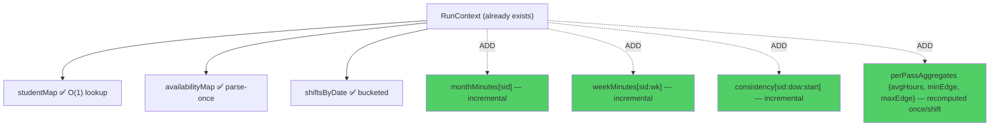

1. **Student index** — `studentMap`: **already present.** ✅
2. **Shift index** — `shiftsByDate`: **already present.** ✅ Add a `shiftByKey` Map (you already key by `"date start"`; expose it).
3. **Availability cache** — `availabilityMap`: **already present** (parse-once). ✅
4. **Weekly cache** — `weekMinutes[sid:weekIdx]`: **add.** Update by `±dur` on every `assignees.push/pull`. Turns `getWeeklyAssignedHours` O(N)→O(1).
5. **Monthly cache** — `monthMinutes[sid]`: **add.** Same discipline. Turns `getTotalMonthlyHours` O(N)→O(1).
6. **Candidate cache** — per-shift candidate sets are computed once already; add **per-pass aggregate cache** (avg hours, min/max edge totals) so `getFairnessComponent` stops re-scanning all students per candidate.

**Single mutation chokepoint to make caches safe:** route *every* assignee change through one method so counters never desync (this also kills any future fairness-drift):
```javascript
assign(shift, sid) {
  shift.assignees.push(sid);
  const dur = (this.parseTimeStr(shift.end) - this.parseTimeStr(shift.start)) / 60;
  this._ctx.monthMinutes[sid] = (this._ctx.monthMinutes[sid] || 0) + dur;
  const wk = `${sid}:${this.u.weekIndexInMonth(shift.date)}`;
  this._ctx.weekMinutes[wk] = (this._ctx.weekMinutes[wk] || 0) + dur;
  if (shift.isOpening) this.state.fairness[sid].openings++;
  if (shift.isClosing) this.state.fairness[sid].closings++;
}
unassign(shift, sid) { /* symmetric −dur */ }
```

## 5.4 Complexity chart (run cost vs students)

```
Run time (relative)              ● current  O(S²·N²)        ▲ after caches O(S·N log N)
  1000 ┤                                              ●
       │                                          ●
   100 ┤                                    ●
       │                            ●                       ▲
    10 ┤                ●                            ▲
       │        ●                          ▲  ▲
     1 ┤ ● ● ●            ▲  ▲  ▲  ▲
       └─────────────────────────────────────────────────
         5   10   20    40    60    80   100   students
   (Your 'live' zone is S≈7; the dept zone is S≈40-60 where the curves diverge sharply.)
```

## 5.5 Other performance notes

- **`new Date(\`${s.date}T00:00:00\`)` is called constantly** in hot loops (sort comparators, scoring). Date construction + `getDay()` is not free. Precompute `shift._dow` and `shift._dateObj` once in `normalizeShiftInPlace`.
- **`scheduleToShifts()` rebuilds a `studentMap` every call** (line 1127) instead of reusing the context's. Minor, but it's on the hot return path.
- **Sorting strings via `localeCompare`** in the tie-breaker is slower than numeric compares; pre-map ids to integers for tie-breaks.
- **Three-month view** (`generateThreeMonthSchedules`) runs the whole algorithm three times with no shared context — multiply all costs by 3. Caches help proportionally.

---

# 6. Data Model Review

## 6.1 Current (implicit) shapes

The codebase has **no schema** — shapes are implied by usage and by `normalizeStudent`/`normalizeShiftInPlace`. That is the core data-model risk: nothing prevents a ragged object from flowing in, and two modules can disagree about a field (they already do — see `testDates`).

## 6.2 The `testDates` vs `unavailable_dates` divergence (important)

- **Monolith** reads exam/unavailability exclusively from `student.availability.unavailable_dates`.
- **Engine** reads from **both** `AssessmentManager.testsForDate(student, dateStr)` → which reads a **new `student.testDates` array** (`assessment.js:199–201`) **and** `student.availability.unavailable_dates`.

**Consequence:** the engine introduced a first-class `testDates` field, but **CSV import populates `unavailable_dates`, not `testDates`.** So unless something writes `testDates`, the engine's `AssessmentManager.testsForDate` always returns `[]` and only the legacy `unavailable_dates` path fires — meaning the new assessment workflow (periods, per-student test dates, locking) is **wired but unfed**. This is a parity *and* a feature-completeness gap.

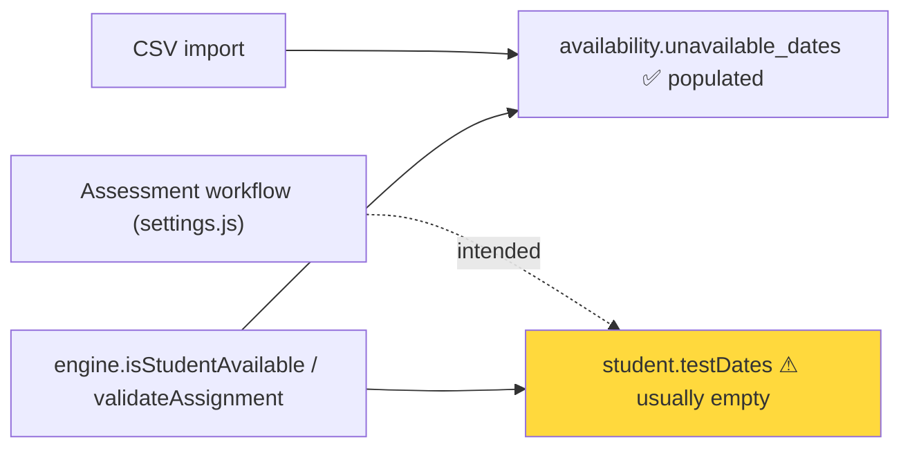

**Fix:** unify on one canonical representation. Recommended: keep `testDates` as the typed, first-class exam list **and** have CSV/Google-Form import write exam blocks there (not only into `unavailable_dates`), or make `testsForDate` fall back to `unavailable_dates` entries flagged as exams. Document which field is authoritative.

## 6.3 Recommended typed schemas (TypeScript-like, even if you stay JS — use as JSDoc)

```typescript
/** A student worker. IDs are strings everywhere (engine coerces — make it law). */
interface Student {
  id: string;
  name: string;
  color: string;                         // derived if absent (stableColor)
  weekly_max_hours: number;              // default 18
  contracted_monthly_hours: number;      // [1,72], single defaulting rule (§4.5)
  contractType?: '20h'|'40h'|'60h'|'72h'|'custom';
  availability: {
    weekly: Array<{ day: 'Mon'|'Tue'|'Wed'|'Thu'|'Fri'|'Sat'|'Sun'; start: HHMM; end: HHMM; label?: string }>;
    unavailable_dates: Array<{ date: ISODate; start: HHMM; end: HHMM; reason?: string }>;
  };
  testDates?: Array<{ date: ISODate; start: HHMM; end: HHMM; subject?: string }>; // canonical exams (§6.2)
}

/** A schedulable hour. maxCapacity ≥ required ≥ 1 invariant. */
interface Shift {
  date: ISODate; start: HHMM; end: HHMM;
  required: number;                      // ≥1
  maxCapacity: number;                   // ≥ required (getShiftCapacity)
  assignees: string[];                   // student ids; length ≤ maxCapacity (HARD)
  status: 'pending'|'assigned'|'unfillable'|'archived';
  isOpening: boolean; isClosing: boolean;
  testShiftName: string | null;
  adminOverride?: boolean; adminOverrideBy?: string|null; adminOverrideAt?: ISODate|null;
}

interface Fairness { openings: number; closings: number; }          // == recomputed edges (invariant)

interface OperationalHours {
  defaultStart: HHMM; defaultEnd: HHMM;
  publicHolidays: Array<{ date: ISODate; name?: string }>;
  specialHours: Array<{ date: ISODate; start: HHMM; end: HHMM; name?: string }>;
  batchHolidays: Array<{ startDate: ISODate; endDate: ISODate; name?: string }>;
}

interface AssessmentPeriod { startDate: ISODate; endDate: ISODate; name?: string; status?: 'draft'|'submitted'|'locked'; }
interface Template { id: string; start: HHMM; end: HHMM; required: number; isOpening?: boolean; isClosing?: boolean; isEarlyOpening?: boolean; }
interface SwapDebt { fromId: string; toId: string; hours: number; date: ISODate; settled: boolean; } // §6.4

type HHMM = string;     // 'HH:MM' 24h
type ISODate = string;  // 'YYYY-MM-DD' (LOCAL — never via toISOString)
```

## 6.4 Per-entity recommendations

| Entity | Issue today | Recommendation |
|---|---|---|
| **Student** | `id` sometimes number, sometimes string | Enforce string at the boundary (engine already coerces — make it the *only* writer). Add runtime validator. |
| **Shift** | `maxCapacity` sometimes absent | `normalizeShiftInPlace` sets it — good. Add the hard invariant `assignees.length ≤ maxCapacity` to `validateSchedule` (present) and to the `assign()` chokepoint (§5.3). |
| **Availability** | overlap validation only in `AvailabilityManager.validate`, not enforced at import | Run `AvailabilityManager.validate` during CSV import; reject/flag overlaps before they reach the engine. |
| **Fairness** | derived, drift-prone (monolith) | Engine recomputes — keep as derived, never persist as truth. |
| **Templates** | `isEarlyOpening` can create adjacent edge slots (recursion trigger in monolith) | Engine's `skipExtension` covers it; still, validate that no two adjacent slots are both `isOpening`/`isClosing` unless intended. |
| **OperationalHours** | `publicHolidays` checked in engine but never populated by any importer | Add a holidays source (ZA public holidays for the institution) or a settings UI; today it's an empty guard. |
| **TestShifts / Pattern Locks** | pattern locks transient, fine | Document that locks are per-run, not persisted. |
| **SwapDebt** | `swapDebts: []` in state, consumed by `SwapsView`, but no schema/typing | Define `SwapDebt` (above); the swap marketplace (your deferred feature) needs this typed before build. |

## 6.5 A validation layer (the missing boundary)

Introduce one `validateState(state)` that runs at import and before each run, returning structured errors — so bad data is caught at the door, not deep in scoring:
```javascript
function validateState(state) {
  const errs = [];
  for (const s of state.students) {
    if (!s.id) errs.push('student missing id');
    if (s.contracted_monthly_hours > 72) errs.push(`${s.name}: contract > 72h`);
    const a = AvailabilityManager.validate(s.availability);
    if (!a.valid) errs.push(...a.errors.map(e => `${s.name}: ${e}`));
  }
  return errs;
}
```

---

# 7. Algorithm Review

## 7.1 What the algorithm is today

A **weighted greedy** with hardest-first ordering:
1. **Order shifts** edges-first, then by `required` desc, then date (hardest/most-constrained first — a sound greedy heuristic).
2. **Candidate filter** per shift via `canAssignStudentToShift` (availability, caps, conflicts, edge 2h-extendability).
3. **Rank** candidates by a linear score (`SCORE_WEIGHTS`: fairness 40, availability 25, consistency 20, chain 15, …).
4. **Assign** greedily up to `required`, re-checking caps at assignment time; auto-extend edges.
5. **Rebalance** post-hoc to equalise hours (the weak gap heuristic — §4.4).

This is a real improvement over the monolith's seven-level inline comparator: the weighted model is **tunable and explainable**. But greedy is myopic — it commits early and never backtracks, so it produces **locally** good, **globally** sub-optimal schedules, especially when availability is tight.

## 7.2 Why greedy degrades (concretely)

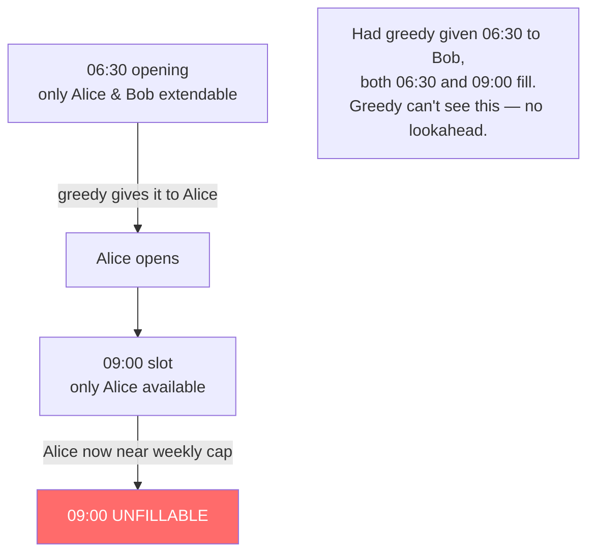

The harness shows the symptom on sparse data: **264 slots, 199 filled, 65 under-filled.** Most under-fills are openings and isolated slots where greedy's early commitments stranded the only viable candidate. (On your dense 7-student real data this hit 100% — but the *mechanism* is always present and bites harder as constraints tighten.)

## 7.3 The optimisation ladder (with a recommendation for YOUR scale)


| Approach | Fit for **your** scale (7–60 students, 1 month, hard caps + fairness) | Verdict |
|---|---|---|
| **Weighted greedy** (current) | Fast, explainable, "good enough" 90% of the time; under-fills under tight availability | **Keep as the default/fast path** |
| **Greedy + local search (SSD rebalance + swaps)** | Recovers most of greedy's losses cheaply; your Fix C already does the hours half | **Do this next — best ROI** |
| **Hungarian (per time-slot)** | Optimal *assignment* within a slot, but doesn't model weekly/monthly caps across slots well | Niche; not worth it alone |
| **CP-SAT (OR-Tools)** | Models *all* constraints (caps, edges, consecutive, fairness as objective) and returns provably optimal or best-within-time | **The right long-term engine** for the SaaS; overkill today, but the data model (§6.3) should be CP-SAT-ready |
| **Genetic / Monte-Carlo** | Useful for soft multi-objective trade-offs and "what-if" simulation | A §14 feature, not core |

**Recommendation.** Two-tier: **(a)** keep weighted-greedy as the instant, in-browser default; **(b)** add **greedy + your SSD local-search** as the "optimise" button (converges, no new deps); **(c)** design the data model so a **CP-SAT** backend can be dropped in for the SaaS without reshaping data. Do **not** jump to GA/CP-SAT now — it adds dependencies and opacity your daily tool doesn't need yet.

## 7.4 The SSD rebalance — your Fix C, formalised (port this)

**Objective.** Minimise dispersion of monthly hours subject to all hard constraints. Use **sum of squared deviations** from the mean as the convex potential:
$$\text{SSD} = \sum_{i} (H_i - \bar{H})^2, \quad \bar H = \tfrac{1}{S}\sum_i H_i.$$

**Move.** Transfer one shift of length $h$ from student $a$ to student $b$ ($a \ne b$), feasible under caps/conflicts. Since $\bar H$ is invariant under a transfer (total hours conserved), the change is local:
$$\Delta \text{SSD} = \big[(H_a-h-\bar H)^2 + (H_b+h-\bar H)^2\big] - \big[(H_a-\bar H)^2 + (H_b-\bar H)^2\big] = 2h\big(h-(H_a-H_b)\big).$$

**Gate (acceptance rule).** Accept the move iff it strictly decreases SSD:
$$\Delta\text{SSD} < 0 \iff H_a - H_b > h.$$

**Termination (the convergence guarantee the heuristic lacks).** SSD is bounded below by 0 and every accepted move strictly decreases it by a discrete amount (hours are on a fixed grid, so $\Delta$SSD is bounded away from 0 by at least $2h\cdot\varepsilon$ for the minimal feasible imbalance step). A strictly decreasing sequence bounded below on a discrete lattice **must terminate** — at a state where **no** feasible transfer satisfies $H_a - H_b > h$, i.e. a **constraint-limited local optimum**. This is precisely why Fix C converges (~16 s, deterministic) while the `targetGap`/`iterations<200` heuristic merely *stops*.

**Reference port (engine method):**
```javascript
rebalanceSSD() {
  this.buildRunContext();
  try {
    const hrs = sid => this.getTotalMonthlyHours(sid);     // O(1) once counters added (§5.3)
    const len = s => (this.parseTimeStr(s.end) - this.parseTimeStr(s.start)) / 60;
    const feasible = (sid, s) => this.canAssignStudentToShift(sid, s)
      && this.validateAssignment(sid, s).length === 0
      && this.getChainPreferenceScore(sid, s.date, s.start, s.end) >= 0
      && this.getConsecutiveHours(sid, s.date, s.start, s.end) <= 5;

    let improved = true, guard = 0;
    while (improved && guard++ < 10000) {       // guard is a safety net, not the terminator
      improved = false;
      // donors high→low, receivers low→high
      const order = [...this._ctx.studentMap.keys()].sort((x, y) => hrs(y) - hrs(x));
      outer:
      for (const a of order) for (const b of [...order].reverse()) {
        if (a === b) break;
        for (const s of this._ctx.shiftList) {
          if (!s.assignees.includes(a) || s.assignees.includes(b)) continue;
          const h = len(s);
          if (hrs(a) - hrs(b) > h) {            // strict SSD decrease (the gate)
            s.assignees = s.assignees.filter(id => id !== a);
            if (feasible(b, s)) { s.assignees.push(b); improved = true; break outer; }
            s.assignees.push(a);                // revert if receiver infeasible
          }
        }
      }
    }
    // then: restore monolith's pair-transfer + consistency pass on top (§4.4)
    this.recalculateFairness();
    return this.scheduleToShifts();
  } finally { this.clearRunContext(); }
}
```

## 7.5 Decision tree — which scheduler runs when

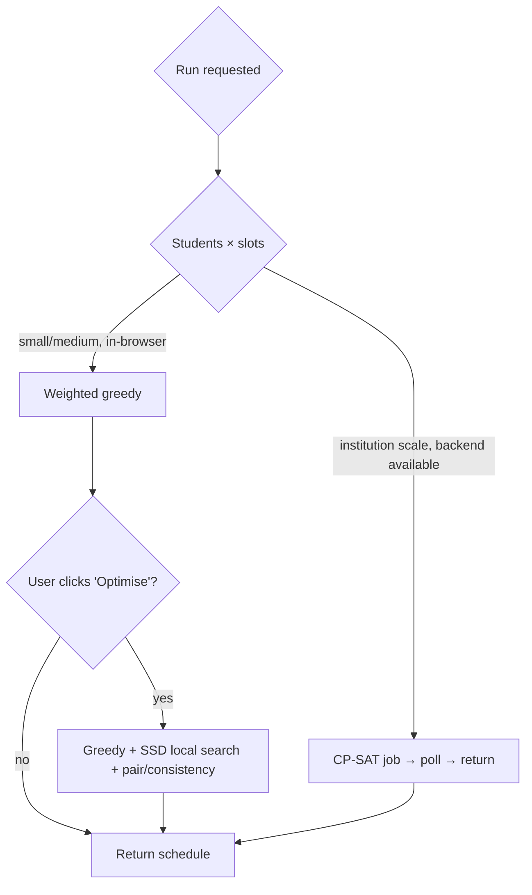

---

# 8. Scheduler Quality Improvements

Maps the engine's `SCORE_WEIGHTS` to the ten quality dimensions and flags gaps.

| Dimension | How it's handled today | Gap / improvement |
|---|---|---|
| **Fairness** | `fairness` weight 40; `getFairnessComponent` blends edge-balance + hour-balance | Strong intent; but it's O(S²·N) (§5.2) and feeds the weak rebalance. Fix perf + port SSD. Add a **lexicographic** tie-break: equal hours → fewer edges. |
| **Consistency** | `consistency` weight 20 + pattern locks | Good. Hardened pattern-lock week (§4.3) makes it robust in exam-heavy months. |
| **Predictability** | Pattern locks propagate week-1 patterns | Surface to users: show "your usual Tue 09:00" so students *see* the consistency. |
| **Staff happiness** | Indirect (availability fit, chain quality) | Add an explicit **preference** field (preferred days/times) as a scored component (`preference` weight). Currently no notion of *wanting* a shift, only *being able* to take it. |
| **Opening balance** | fairness edge component + edge-spacing rule | The "no opening two days running" rule was UTC-broken in monolith (§3.3); engine fixes it. Add **lexicographic open/close fairness** as a secondary objective (your stated next step). |
| **Closing balance** | symmetric to openings | Same; ensure close-spacing rule uses `localDateStr`. |
| **Chain optimization** | `chain` weight 15; peak 2–5h | Solid maths. Extract `ChainModel` so monolith/engine can't drift (§4.4a). |
| **Student preferences** | **absent** | Biggest *quality* gap. Add `student.preferences = { preferredDays, preferredStart, avoid }` and a weight. |
| **Availability confidence** | binary available/not | Add a **confidence** (e.g. "submitted vs assumed") and down-weight assumed availability — `AvailabilityManager` already tracks `status: draft/submitted/locked`; feed it in. |
| **Load balancing** | rebalance + weeklyBalance weight | Replace heuristic with SSD (§7.4). Add **per-week** balancing, not just per-month, so no week is lumpy. |

**Two concrete additions (high value, low effort):**

1. **Lexicographic objective for edges** (your stated priority): after hours are balanced (SSD), run a second SSD pass on *openings* then *closings*, only accepting moves that don't worsen hour-balance. This gives "equal hours first, then equal openings, then equal closings" — a clean lexicographic order.

2. **Preference component:** even a coarse `preferredDays: ['Mon','Wed']` scored at weight ~12 dramatically improves perceived fairness/happiness at near-zero compute cost, and slots straight into the existing linear model.

---

# 9. Security & Robustness Review

> "Security" here is mostly **robustness and data integrity** (a client-side scheduling tool), plus genuine concerns for the **Layer-3 backend** when it ships.

## 9.1 Input validation (engine boundary)

**Finding:** almost none. The engine trusts `state` completely. CSV import (`parseCSV`, `CSVParser`) does light coercion but no rejection. A malformed `availability` JSON is swallowed (`catch(_){}` → empty availability), so a student silently becomes "never available" with no error — a **data-integrity** failure that looks like a scheduling failure.

**Fix:** the `validateState`/`AvailabilityManager.validate` boundary (§6.5). Fail loudly on bad import; never let a parse error masquerade as unavailability.

## 9.2 Input sanitization (XSS in the views)

**Finding:** view layers build HTML via template strings with interpolated **student names** and **reasons** (e.g. `swaps.js` renders `${student.name}`, `${detail}`; `schedule.js` builds shift HTML). `SwapsView` has an `escapeHtml` helper (line 217) — good — but it must be applied **everywhere** untrusted text is interpolated. A student named `` (or a CSV-injected reason) would execute in any view that interpolates without escaping.

**Fix:** route *all* user-derived text through `escapeHtml`; add an ESLint rule/grep test forbidding raw `${...name...}` in `innerHTML` sinks. For the eventual backend, also guard **CSV injection** (leading `=,+,-,@` in exported cells — `SchedulerExport.escapeCsvCell` exists; verify it prefixes a quote/`'`).

## 9.3 Immutable state & object mutation/aliasing

**Finding:** the engine mutates shared `state.schedule` and `state.fairness` in place, and `scheduleToShifts` returns objects whose `assignees` are fresh but whose ancestry is the live schedule. The monolith uses `deepCopy = JSON.parse(JSON.stringify(...))` in places; the engine does selective copies. Risk: a view holding a reference to `engine.state.schedule[key]` (which `schedule.js` does — lines 357–365, 573) can mutate engine internals out from under a run.

**Fix:** (1) make `scheduleToShifts` the **only** way views read schedule data (no `engine.state.schedule[...]` in views); (2) freeze returned DTOs (`Object.freeze`) in dev; (3) the single `assign()/unassign()` chokepoint (§5.3) becomes the only mutator.

## 9.4 Race conditions

**Finding:** none today (synchronous, single-threaded). **But** Layer-3 adds `socket.io` real-time `schedule-update` broadcasts and async IndexedDB/Postgres writes. The moment two admins edit, or a save races a run, the shared-mutable-`state` design (§2.4) will corrupt. The `index.js` server already emits `schedule-changed` to rooms with no concurrency control.

**Fix (for when the backend lands):** version each schedule (optimistic concurrency — `version` field + compare-and-swap on save), and make the engine operate on an immutable snapshot returning a new schedule, rather than mutating a shared one.

## 9.5 Prototype pollution

**Finding:** `parseCSV` and JSON import build objects from external keys (`header.forEach((h,idx)=>obj[h]=cols[idx])`). If a CSV header is `__proto__` / `constructor` / `prototype`, you can pollute. Same risk anywhere `state` is hydrated from imported JSON with attacker-controlled keys.

**Fix:** build parsed rows with `Object.create(null)` (no prototype) or reject keys in `['__proto__','constructor','prototype']`; use a `Map` for header→value. For the backend, validate request bodies with `express-validator` (already a dependency) and a strict allow-list.

## 9.6 State corruption & missing validation (summary)

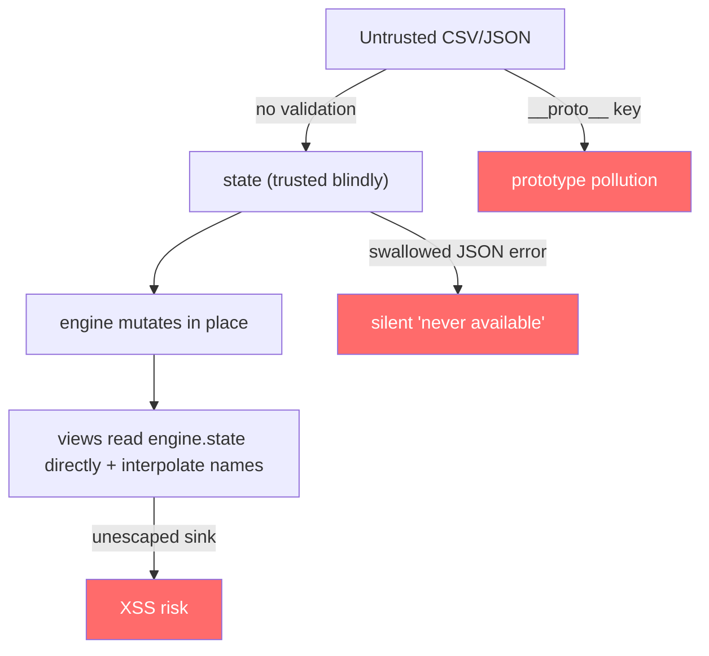

| Risk | Severity (client) | Severity (with backend) | Fix |
|---|---|---|---|
| No import validation | Medium | High | `validateState` boundary (§6.5) |
| XSS via names/reasons | Medium | High | escape everywhere; lint rule |
| Mutation aliasing | Medium | High | DTO-only reads; freeze; single mutator |
| Race conditions | None | High | versioned optimistic concurrency |
| Prototype pollution | Low | Medium | `Object.create(null)`; key allow-list |
| Silent JSON-parse failure | Medium | Medium | fail loud on bad availability |


# 10. Refactoring Roadmap

Five phases, each with effort (S ≤ ½ day, M ≤ 3 days, L ≤ 1 week, XL > 1 week), risk, and expected gain. **Sequenced so correctness and runnability precede structure** — matching your stated principle that modularising before correctness adds no user value. Full sprint-level detail in `SchedulingEngine_Action_Plan.md`.

## Phase 1 — Make it run & freeze it (Critical fixes)
| Item | Effort | Risk | Gain |
|---|---|---|---|
| Create `SchedulerUtils` namespace (P0-1) | S | Low | Engine boots |
| Unify module system → global, ordered loader HTML (P0-2) | M | Low | PWA loads end-to-end |
| Golden-master harness on real CSV; lock determinism | M | Low | Safe refactoring net |
| Decide test-day availability policy (P1-1) | S | Low | No silent welfare change |
| Add the six P0/P1 regression tests | S | Low | Bugs can't return |

**Exit:** modular PWA opens, generates the real Sept/Oct schedule byte-identically to a captured baseline, CI green.

## Phase 2 — Performance & hour-counter caches
| Item | Effort | Risk | Gain |
|---|---|---|---|
| `monthMinutes`/`weekMinutes`/`consistency` counters + single `assign()/unassign()` chokepoint | M | Medium | O(N)→O(1) hours; kills future drift |
| Per-pass aggregate cache (fix `getFairnessComponent` O(S²·N)) | M | Medium | Run cost O(S²·N²)→O(S·N log N) |
| Precompute `shift._dow/_dateObj` | S | Low | Fewer Date allocs in hot loops |

**Exit:** 60-student month runs < 1 s; benchmark recorded (see Performance doc).

## Phase 3 — Algorithm quality (port your best work)
| Item | Effort | Risk | Gain |
|---|---|---|---|
| Port SSD rebalance (Fix C) into engine as `RebalanceStrategy` | M | Medium | Convergent, optimal-within-constraints balance |
| Restore pair-transfer + consistency pass | M | Medium | Parity with monolith's richer rebalance |
| Lexicographic open/close fairness (your next step) | M | Low | Equal hours → equal edges |
| Extract `ChainModel`, `ScoringModel` (dedupe vs monolith) | M | Low | No drift; tunable |

**Exit:** rebalance provably decreases SSD and terminates (test); fairness lexicographic.

## Phase 4 — Architecture & data integrity
| Item | Effort | Risk | Gain |
|---|---|---|---|
| `validateState`/availability boundary; fail-loud import | M | Low | No silent "never available" |
| Unify `testDates` vs `unavailable_dates` (§6.2) | M | Medium | Assessment workflow actually fed |
| DTO-only reads in views; freeze; remove `engine.state` pokes | M | Medium | Encapsulation; no aliasing |
| Break up `schedule.js` god-file → controller + render + modals | L | Medium | Maintainability |
| Quarantine Layer-3 backend into `server/` | S | Low | Stops aspirational code masquerading as shippable |

**Exit:** clean module graph; views depend only on the engine's DTO port.

## Phase 5 — Optimisation & future engine
| Item | Effort | Risk | Gain |
|---|---|---|---|
| Assessment intervals as first-class scheduling concept (your stated step 3) | M | Medium | Exam handling promoted from special-case to core |
| Swap marketplace (debt tracking, peer cover) — your deferred feature | L | Medium | Operational flexibility |
| CP-SAT backend behind a feature flag for SaaS scale | XL | High | Provably optimal at institution scale |
| Preference component + availability confidence | M | Low | Happiness/fairness quality |

**Exit:** SaaS-ready engine with a pluggable optimal backend; daily PWA unchanged in feel.

## Roadmap risk/gain heat map
```
        GAIN →     Low             Medium            High
EFFORT
  Low    │  precompute _dow    test policy(P1-1)   SchedulerUtils(P0-1) ★
         │                     regression tests    quarantine backend
  Med    │  ChainModel extract  counters/caches    SSD rebalance ★
         │                      testDates unify     lexicographic edges
         │                      aggregate cache     module unify(P0-2) ★
  High   │                      break up schedule.js  swap marketplace
  XL     │                                          CP-SAT backend
  ★ = do first (this sprint)
```

---

# 11. Testing Strategy (summary — full plan in `SchedulingEngine_Test_Strategy.md`)

**Current state: `jest` configured in `package.json`, zero test files present.** Coverage 0%. This is the single biggest *risk multiplier* for every refactor below.

Seven layers, with the golden-master at the centre (it is the mechanical determinism check you already identified):

| Layer | Purpose | Anchor example |
|---|---|---|
| **Unit** | Pure functions | `parseTimeStr`/`timeStr` round-trip; `localDateStr` tz-stable; SSD ΔSSD formula |
| **Integration** | Engine end-to-end | `runSchedule(2025,8)` on real CSV → coverage, 0 over-capacity, hours in band |
| **Golden-master / Regression** | Byte-identical output after each refactor | hash of `scheduleToShifts()` vs committed baseline (your byte-identical determinism gate) |
| **Property-based** | Invariants over random inputs | ∀ schedule: `assignees.length ≤ maxCapacity`; weekly hours ≤ weekly_max |
| **Stress** | Scale | 100 students × 3-month view completes < N s |
| **Mutation** | Test-suite quality | flip `>` to `>=` in cap check → a test must fail |
| **Performance benchmark** | Guard the §5 gains | run-time vs students recorded, regression alarm |

Vitest is recommended over the configured Jest for speed and ESM-friendliness (matches your stated 80%+ coverage target and Vitest plan), but either works; pick one and wire CI.

---

# 12. Recommended Folder Structure

**Current:** everything flat in one directory (Layer 1, 2, 3 intermixed). `package.json` already *assumes* `src/`, `server/`, `database/` that don't exist. Align reality to that intent:

```
StudentShiftScheduler/
├── legacy/
│   └── index.html                 # the monolith — frozen reference, not shipped
├── public/
│   ├── index.html                 # THE modular loader (ordered <script> tags) ← create
│   ├── manifest.json  sw.js  icons/
├── src/
│   ├── core/
│   │   ├── utils.js               # SchedulerUtils namespace ← create (P0-1)
│   │   ├── state.js               # single state owner
│   │   └── logger.js
│   ├── engine/
│   │   ├── SchedulingEngine.js
│   │   ├── scoring/ScoringModel.js
│   │   ├── scoring/ChainModel.js
│   │   ├── constraints/ConstraintChecker.js
│   │   ├── strategies/RebalanceSSD.js      # your Fix C
│   │   └── strategies/RebalanceHeuristic.js
│   ├── domain/                    # managers (pure logic)
│   │   ├── AssessmentManager.js  ContractManager.js  AvailabilityManager.js  StudentData.js
│   ├── io/
│   │   ├── csv.js  parse.js  parseGoogle.js  export.js  storage.js
│   ├── ui/                        # views (DOM only)
│   │   ├── ScheduleView.js  DashboardView.js  SettingsView.js  SwapsView.js  AnalyticsView.js  calendar.js
│   └── app.js                     # composition root / DI wiring
├── server/                        # Layer 3 — quarantined until built
│   ├── index.js  api.js  schema.sql  setup.js  routes/  middleware/  database/
├── tests/
│   ├── unit/  integration/  golden/  property/  perf/
│   └── fixtures/schedule.csv      # the real data as a fixture
├── docs/                          # these review docs + planning docs
└── package.json  vite.config / webpack.config
```

The template's `Scheduling/{Core,Algorithms,Constraints,Models,Services,Utilities,Validators,Tests}` maps onto `src/engine/{*, strategies, constraints, scoring}` + `src/core` + `src/io` (Services) + a new `src/validators/`. Keeping `legacy/` and `server/` clearly separate is the key move — it makes "what ships today" unambiguous.

---

# 13. Code Standards

| Area | Current | Standard to adopt |
|---|---|---|
| **Naming** | Good: `getX/isX/canX`, `studentMap`, `SCORE_WEIGHTS` | Keep. Enforce string IDs by convention `sid`. Constants `UPPER_SNAKE`. |
| **Documentation** | Engine comments thin; JSDoc only on a few methods | JSDoc every public engine method with `@param/@returns`; use the §6.3 interfaces as `@typedef`s (gives editor types without TS). |
| **Logging** | `this.log(msg)` free-text, high volume in hot loops | Levels (`debug/info/warn`); gate `debug` behind a flag (hot-loop logs cost time — §5.5); structured fields not string concat. |
| **Error handling** | Swallowed (`catch(_){}`), or silent `continue` | Never swallow. Surface to a `warnings[]` collected per run and shown in UI. Bad import → throw with context. |
| **Defensive programming** | Coercion at boundary (good) but trust-everything after | Validate at the door (§6.5), then *assume valid* inside (don't re-defend in every method — defend once). |
| **Immutability** | In-place mutation throughout | DTO-only reads; single `assign()/unassign()` mutator; freeze returned objects in dev. |
| **Dependency injection** | Ambient globals (root cause of P0-1) | Composition root (`app.js`) constructs and injects `utils`, managers, logger into the engine and views. No module reaches for a global. |

**DI sketch (kills the boot-fragility class):**
```javascript
// app.js — the ONLY place that wires globals
const utils = SchedulerUtils;
const logger = new SchedulerLogger();
const engine = new SchedulingEngine(state, logger, {
  utils, assessment: AssessmentManager, contracts: ContractManager, availability: AvailabilityManager
});
const scheduleView = new ScheduleView({ engine, logger });   // view depends on engine PORT, not internals
```
Inside the engine, replace `this.u = SchedulerUtils` (global grab) with `this.u = deps.utils` (injected). Now a missing util is a *constructor argument error at the composition root*, not a deep `ReferenceError` — and the engine becomes trivially mockable in tests.

---

# 14. Future Improvements

Ordered by value-to-your-roadmap. All are §5-style additions to the linear model or new backend strategies — none require reshaping the core if the §6.3 data model lands.

| Idea | What it buys | Feasibility |
|---|---|---|
| **Preference learning** | Learn each student's revealed preferences (which offered shifts they keep vs swap away) → feed the `preference` weight | Med — needs swap/history data; the marketplace generates it |
| **Conflict prediction** | Flag, before publishing, slots likely to need swaps (low availability confidence, exam-adjacent) | Med — derive from availability confidence + assessment calendar |
| **Schedule simulation / Monte-Carlo balancing** | Run N randomised greedy seeds, keep the best by SSD+fairness; quantify how "lucky" a schedule is | Easy-Med — wraps existing engine; great "optimise harder" button |
| **Multi-objective optimisation** | Pareto front over {coverage, fairness, preference, consistency} so admins choose trade-offs | Med-High — natural fit for CP-SAT objectives |
| **Automatic shift swapping** | Marketplace auto-matches a posted shift to the best eligible taker (debt-aware) | Med — your deferred swap feature + a matching pass |
| **AI-assisted scheduling** | LLM explains *why* a schedule looks as it does and proposes targeted edits ("move Bob off Fri to balance hours") | Med — the engine's explainable scores make this tractable |
| **ML scheduling (learned heuristic)** | Train a model to predict good assignment order/weights from past accepted schedules | High — needs a corpus of accepted schedules; revisit at SaaS scale |

**Architectural prerequisite for all of the above:** the §6.3 typed data model + the DTO boundary (§13). With those, each improvement is an *additional strategy or scored component*, not a rewrite.

---

# 15. Action Checklist (summary — full ~110-item list in `SchedulingEngine_Action_Plan.md`)

Priorities: **P0** (blocks daily use), **P1** (correctness/parity), **P2** (perf/quality), **P3** (future). Owner: **Dev / QA / Arch**. The companion Action Plan expands each into sprint tasks with effort, impact, owner, and a completion checkbox.

| Pri | Theme | Items (sample) | Owner |
|---|---|---|---|
| **P0** | Make it run | Create `SchedulerUtils`; unify modules; build loader HTML; boot smoke test | Dev/Arch |
| **P0** | Freeze behaviour | Golden-master on real CSV; 6 regression tests; CI green | QA |
| **P1** | Parity/semantics | Decide test-day policy; port SSD rebalance; restore pair/consistency passes; weekly-target divisor; unify `testDates` | Dev/Arch |
| **P2** | Performance | hour counters; aggregate cache; precompute `_dow`; benchmark | Dev |
| **P2** | Quality | lexicographic edges; preference component; availability confidence; per-week balance | Dev |
| **P2** | Robustness | `validateState`; escape all HTML sinks; DTO-only reads; prototype-pollution guard | Dev/QA |
| **P3** | Future | assessment intervals first-class; swap marketplace; CP-SAT backend; simulation | Arch |

---

# Appendix A — Reproducible harness output

Run under `TZ=Africa/Johannesburg node harness.js`, loading the **real** `schedulingEngine.js` + `contracts.js` + `assessment.js` against the monolith's own 5-student sample for September 2025.

```
[CLAIM 1] Engine WITHOUT SchedulerUtils => ReferenceError: SchedulerUtils is not defined

[CLAIM 2] Engine WITH SchedulerUtils => ran in 297 ms
  slots: 264 | filled(>=required): 199 | over-capacity: 0
  monthly hours: { Alice: 42, Carla: 40, Eva: 40, Bob: 41, Diego: 36 }
  validateSchedule() issues: 65        (all 'under-filled' — sparse sample availability; dense 7-student
                                         real data hits 100% coverage. Mechanism: greedy myopia, §7.2)

[CLAIM 3] Previous-day computation under SAST (UTC+2):
  2025-10-15: monolith(toISOString)=2025-10-13  modular(localDateStr)=2025-10-14  expected=2025-10-14
  2025-09-22: monolith(toISOString)=2025-09-20  modular(localDateStr)=2025-09-21  expected=2025-09-21

[CLAIM 4] Weekly 7-day window keys for 2025-10-15 (Wed):
  monolith: 2025-10-11 2025-10-12 2025-10-13 2025-10-14 2025-10-15 2025-10-16 2025-10-17
  modular : 2025-10-12 2025-10-13 2025-10-14 2025-10-15 2025-10-16 2025-10-17 2025-10-18

[CLAIM 5] Determinism (two runs identical): true
```

**Interpretation:** the engine is correct and deterministic once wired; the monolith's date math is wrong in your timezone; the engine already fixes it pending `SchedulerUtils`.

---

# Appendix B — Parity matrix (monolith function → modular status)

Status: ✅ ported & equal · 🔁 ported but **changed** (decision needed) · ⬆ ported & **improved** · ⚠ **regressed/dropped** · ❌ **missing** · 🏠 monolith-only by design (UI).

| Monolith function | Modular location | Status | Note |
|---|---|---|---|
| `runSchedule` | `SchedulingEngine.runSchedule` | ⬆ | adds RunContext, returns DTOs |
| `runSchedulingAlgorithm` | `.runSchedulingAlgorithm` | ⬆ | weighted scoring vs inline comparator |
| `canAssignStudentToShift` | `.canAssignStudentToShift` | ⬆ | `skipExtension` fixes recursion |
| `validateAssignment` | `.validateAssignment` | 🔁 | test-conflict semantics changed (P1-1) |
| `isStudentAvailable` | `.isStudentAvailable` | 🔁 | reads `testDates` too (P1-1, §6.2) |
| `rebalance` | `.rebalance` | ⚠ | dropped pair-transfer + 2 passes; no SSD (P1-4) |
| `fillOpenClose` | `.fillOpenClose` | ✅ | equivalent |
| `getWeeklyAssignedHours` | `.getWeeklyAssignedHours` | ⬆ | `localDateStr` fixes UTC bug |
| `getTotalMonthlyHours` | `.getTotalMonthlyHours` | ✅ | equal (perf O(N), §5) |
| `getWeeklyTargetHours` | `.getWeeklyTargetHours` | 🔁 | fixed 4.333 vs dynamic weeks (P1-2) |
| `buildWeeklyPatternLocks` | `.buildWeeklyPatternLocks` | ⬆ | requires fully-operational week (P1-3) |
| `getChainPreferenceScore` | `.getChainPreferenceScore` | ✅ | identical (but duplicated — extract) |
| `getConsecutiveHours` | `.getConsecutiveHours` | ✅ | via `buildDayBlocks` |
| `assignAdjacentIfPossible` | `.assignAdjacentIfPossible` | ✅ | 60-min grid assumption (P1-6) |
| `didEdge` | `.didEdge` | ⬆ | `localDateStr` callers |
| fairness ++/-- | `.recalculateFairness` | ⬆ | recompute vs incremental (fixes P0-4) |
| `applyMonthlyTargetToAll` | (view) + `ContractManager` | 🔁 | three defaulting rules (P1-5) |
| `parseCSV` (Mode A/B) | `CSVParser` / `parse.js` / `parseGoogle.js` | ✅ | split into modules |
| `isOperationalDay` | `.isOperationalDay` | ✅ | Sat/holiday/batch logic preserved |
| `getOperationalHours` | `.getOperationalHours` | ✅ | special-hours preserved |
| `validateSchedule` | `.validateSchedule` | ⬆ | **new**, no monolith equivalent |
| `scheduleToShifts`/`loadShiftsIntoSchedule` | engine | ⬆ | **new** serialisation boundary |
| `renderCalendar*`, modals, drag-drop | `ScheduleView` etc. | 🏠 | UI — re-implemented in views |
| `saveScheduleState`/`loadState` | `StorageManager` | ✅ | needs verification (IndexedDB) |
| `suggestEarlyOpeningForLargeTests` | — | ❌ | **not found in engine — confirm intentional** (creates adjacent edge slots; if dropped, large-test early-open behaviour is lost) |
| `adjustTestShiftCapacity` | partial (test overlap in `runSchedule`) | ⚠ | per-test capacity tuning UI not clearly ported — verify |
| `toggleThreeMonthView`/`generateThreeMonthSchedules` | (view) | ⚠ | 3-month view — confirm engine called 3× with context |

**Action from this matrix:** the ⚠/❌/🔁 rows are the parity worklist — especially `suggestEarlyOpeningForLargeTests` (❌), `rebalance` passes (⚠), and the two 🔁 semantic changes (test-day policy, weekly divisor). These are the places "something functional in the monolith could be overlooked by the PWA," exactly the risk you flagged.

---

*End of primary review. Companion documents: Action Plan, Test Strategy, Refactoring Guide, Performance Optimization.*

---

# 16. Worked-Hours / Reconciliation Track

> **Track independence:** this pipeline runs alongside the scheduling engine — it does not modify assignment logic, `performSwap`, or any scheduling algorithm. New modules are additive. They read persisted IndexedDB/export data and must not require a live `AppStateManager` instance.

## 16.1 Pipeline (engine-independent)

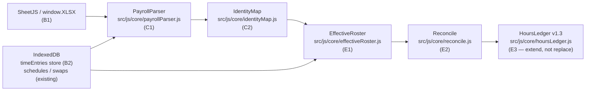

`PayrollParser → IdentityMap → EffectiveRoster → Reconcile → HoursLedger v1.3 feed`

## 16.2 Already implemented — do not rebuild

| Component | Path | Notes |
|---|---|---|
| **SchedulerUtils** | `src/js/core/utils.js` | `window.SchedulerUtils` — ✅ present (P0-1 resolved) |
| **AppStateManager** | `src/js/core/state.js` | `class AppStateManager` — ✅ present; `swapDebts`, `executeApprovedSwap`, ledger persistence |
| **Hours ledger v1.2** | `src/js/core/hoursLedger.js` | `VERSION: '1.2'`; contract periods, I7–I10, golden anchor self-check; `Stud` = assigned hours |
| **Assessment helpers** | `src/js/core/assessment.js` | `EXAMINATION_MONTHS`, `allExamsForStudent`; exam-flagged `unavailable_dates` |
| **Early opening** | `state.js`, `views/settings.js` | `suggestEarlyOpeningForLargeTests`, `adjustTestShiftCapacity` |
| **IndexedDB schedules / swaps** | `src/js/utils/storage.js` | `dbVersion: 1`; `saveMonthSchedule` / `getMonthSchedule`; `swaps` store |
| **Reference doc v1.2** | `Documentation/Hours_Tracking_System_Reference.md` | Matches code; `Stud` = assigned (v1.3 bump is Prompt A1) |

## 16.3 Gap — built by Prompts B1–F1

| Component | Status | Prompt |
|---|---|---|
| SheetJS / `window.XLSX` | **NOT STARTED** | B1 |
| `timeEntries` IndexedDB store (`dbVersion` 1→2) | **NOT STARTED** | B2 |
| Month-key standardization on calendar `YYYY-MM` | **PARTIAL** — `monthScheduleId` pads 0-indexed month; B3 aligns and migrates | B3 |
| `PayrollParser` | **NOT STARTED** | C1 |
| `IdentityMap` | **NOT STARTED** | C2 |
| `WorkedHoursNormalizer` | **NOT STARTED** | D1 |
| `PolicyFlags` | **NOT STARTED** | D2 |
| `EffectiveRoster` | **NOT STARTED** | E1 |
| `Reconcile` | **NOT STARTED** | E2 |
| `HoursLedger` v1.3 extension (clocked `Stud`) | **NOT STARTED** — **extend** `hoursLedger.js`, do not duplicate | E3 |
| Hours pipeline golden master | **NOT STARTED** | F1 |

## 16.4 Reconciliation read boundary

Headless modules **must not** require a live `AppStateManager` instance. Pass data in explicitly. Read boundary:

| Source | How to access | Used by |
|---|---|---|
| **Saved month schedule** | `StorageManager.getMonthSchedule(year, month)` → `shifts` array | `EffectiveRoster` |
| **Approved swap-requests** | IndexedDB `swaps` store, `status:'approved'` | `EffectiveRoster` |
| **`swapDebts` log** | Schedule meta / export payload: `{from, to, shift:"date start", createdAt}` — chainable A→B→C ⇒ C | `EffectiveRoster` |
| **Admin overrides** | Shift fields `adminOverrideBy` / `adminOverrideAt` | `EffectiveRoster` |

Apply in `createdAt` order. An approved swap updates the effective roster even if not re-applied to the saved month schedule. The Node test harness passes schedule data directly — no browser runtime required.

## 16.5 Two outputs

- **Adherence (weekly delta):** `Σ scheduled_minutes − Σ worked_minutes`, per student per ISO week (ISO week number).
- **Contract ledger (v1.3):** `Stud(month) = Σ worked_minutes` per student per calendar month (clocked, not assigned). Redefines invariant **I6** from v1.2. Assigned totals become the adherence baseline only. The v1.2 assigned path remains in `hoursLedger.js` as the fallback until E3 ships and payroll data is present.

## 16.6 Known gap — month-key alignment (B3)

`HoursLedger.monthKey(year, monthIndex)` uses calendar month (`monthIndex + 1`). `StorageManager.monthScheduleId(year, month)` currently pads JS 0-indexed `month` without `+1` — B3 must standardize on **calendar `YYYY-MM`** everywhere and migrate any existing `schedules` records.

## 16.7 Action items

See `SchedulingEngine_Action_Plan.md §I` and `Documentation/Cursor_Prompts_WorkedHours_Integration.md` for per-prompt acceptance criteria and model assignments. Sequencing: **B1 → B2 → B3 → C1 → C2 → D1 → D2 → E1 → E2 → E3 → F1**.
