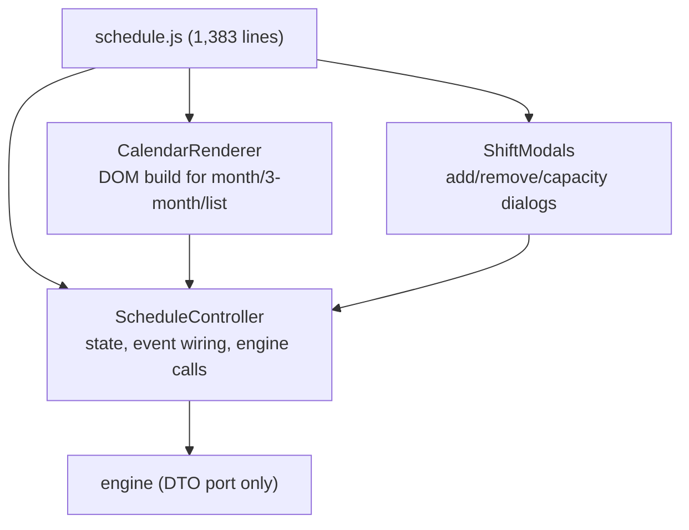

# SchedulingEngine — Refactoring Guide

**Companion to:** `SchedulingEngine_Architecture_Review.md`
**Nature:** concrete, ordered, copy-pasteable steps. Each step has a **before**, an **after**, and a **verify** (the test that proves it worked). The ordering is the safe one: *make it run → freeze it → make it fast → port the best algorithm → clean up*. Nothing structural happens before the golden master exists.

> **Golden rule for this whole guide:** after every step, run the golden master (`SchedulingEngine_Test_Strategy.md` §6). If output changed and you didn't intend it to, revert. If you intended it (only steps 6–7 do), review the diff and re-capture in the same commit.

---

## Step 0 — Establish the safety net (before touching anything)

You cannot refactor safely without these. Do them first.

1. Copy the monolith to `legacy/index.html` — it is now a frozen oracle, never edited again.
2. Stand up the test runner + `tests/setup.js` with `TZ=Africa/Johannesburg` (Test Strategy §2).
3. You will capture the golden master in Step 3, *after* the engine can run.

---

## Step 1 — Create `SchedulerUtils` (fixes P0-1, the boot blocker)

**Problem:** 51 references, 0 definitions. The engine throws `ReferenceError: SchedulerUtils is not defined` at construction.

**Before** — `utils.js` (ESM functions, invisible to global consumers):
```javascript
export function parseTimeStr(t){ const [h,m]=t.split(':').map(Number); return h*60+m; }
export function dateISO(y,m,d){ /* ... */ }
```

**After** — `src/core/utils.js` (global namespace, dual-exported for Node tests):
```javascript
const SchedulerUtils = (() => {
  const pad = n => String(n).padStart(2, '0');
  return {
    pad,
    parseTimeStr(t) {
      const [h, m] = String(t).split(':').map(Number);
      return h * 60 + m;
    },
    timeStr(mins) {                                   // wraps negatives/overflow
      const h = Math.floor((((mins % 1440) + 1440) % 1440) / 60);
      const m = (((mins % 60) + 60) % 60);
      return pad(h) + ':' + pad(m);
    },
    dateISO(y, m, d) { return `${y}-${pad(m + 1)}-${pad(d)}`; },
    localDateStr(date) {                              // LOCAL — the P0-3 fix
      return `${date.getFullYear()}-${pad(date.getMonth() + 1)}-${pad(date.getDate())}`;
    },
    overlap(a1, a2, b1, b2) { return Math.max(a1, b1) < Math.min(a2, b2); },
    stableColor(seed) {
      let h = 0;
      for (const c of String(seed)) h = (h * 31 + c.charCodeAt(0)) >>> 0;
      return `hsl(${h % 360} 70% 55%)`;
    },
    weekIndexInMonth(dateStr) {
      const d = new Date(dateStr + 'T00:00:00');
      const monthStart = new Date(d.getFullYear(), d.getMonth(), 1);
      const dayIndex = Math.floor((d - monthStart) / 86400000);
      return Math.floor((dayIndex + monthStart.getDay()) / 7);
    }
  };
})();
if (typeof window !== 'undefined') window.SchedulerUtils = SchedulerUtils;
if (typeof module !== 'undefined') module.exports = SchedulerUtils;
```

**Verify:** `utils.spec.js` (Test Strategy §4) passes; `new SchedulingEngine(state, logger)` no longer throws.

---

## Step 2 — Unify the module system → global (fixes P0-2)

**Problem:** 5 files are ESM (`export`/`import`), 19 are global (`window.X =`). They can't interoperate in one classic-script page.

**Decision:** convert the 5 ESM files to global. (Rationale and the alternative in Review §3.2.)

**Before** — e.g. `parse.js`:
```javascript
export function parseSchedulerCSV(csvText){ /* ... */ }
export function parseGoogleForm(csvText){ /* ... */ }
```
**After** — `src/io/parse.js`:
```javascript
const SchedulerParse = (() => {
  function parseSchedulerCSV(csvText){ /* ...unchanged body... */ }
  function parseGoogleForm(csvText){ /* ...unchanged body... */ }
  return { parseSchedulerCSV, parseGoogleForm };
})();
if (typeof window !== 'undefined') window.SchedulerParse = SchedulerParse;
if (typeof module !== 'undefined') module.exports = SchedulerParse;
```
Repeat for `state.js`, `parseGoogle.js`, `calendar.js`, and retire the `import(...)` in `main.js` (its logic moves into the loader/`app.js`).

**Verify:** boot smoke test — every `window.*` class/namespace defined under jsdom.

---

## Step 3 — Create the loader HTML + capture the golden master

**Problem:** there is no entry point that loads the modular scripts in order.

**After** — `public/index.html` (order matters: dependencies before dependents):
```html
<!doctype html><html lang="en"><head><meta charset="utf-8">
<meta name="viewport" content="width=device-width, initial-scale=1">
<link rel="manifest" href="manifest.json"><title>StudentShiftScheduler</title>
<link rel="stylesheet" href="styles/app.css"></head>
<body>
  <div id="app"><!-- views render here --></div>

  <!-- 1. core (no deps) -->
  <script src="../src/core/utils.js"></script>
  <script src="../src/core/state.js"></script>
  <script src="../src/core/logger.js"></script>
  <script src="../src/core/config.js"></script>
  <!-- 2. domain managers (depend on core) -->
  <script src="../src/domain/ContractManager.js"></script>
  <script src="../src/domain/AssessmentManager.js"></script>
  <script src="../src/domain/AvailabilityManager.js"></script>
  <script src="../src/domain/StudentData.js"></script>
  <!-- 3. io -->
  <script src="../src/io/csv.js"></script>
  <script src="../src/io/parse.js"></script>
  <script src="../src/io/parseGoogle.js"></script>
  <script src="../src/io/export.js"></script>
  <script src="../src/io/storage.js"></script>
  <!-- 4. engine (depends on core + domain) -->
  <script src="../src/engine/SchedulingEngine.js"></script>
  <!-- 5. ui views (depend on engine) -->
  <script src="../src/ui/calendar.js"></script>
  <script src="../src/ui/ScheduleView.js"></script>
  <script src="../src/ui/DashboardView.js"></script>
  <script src="../src/ui/SettingsView.js"></script>
  <script src="../src/ui/SwapsView.js"></script>
  <script src="../src/ui/AnalyticsView.js"></script>
  <!-- 6. composition root LAST -->
  <script src="../src/app.js"></script>
</body></html>
```

**Then capture the golden master** (Test Strategy §6) from the real `schedule.csv` scenario and commit `baseline.json`.

**Verify:** open in a browser — calendar renders, "Generate" produces a schedule, console is clean. `golden.spec.js` is green. **This is milestone M1.**

---

## Step 4 — The single mutation chokepoint + hour counters (perf; fixes future drift)

**Problem:** `getTotalMonthlyHours`/`getWeeklyAssignedHours` are O(N) and called per-candidate → O(S²·N²) runs; and scattered `assignees.push` sites are how fairness drifted historically.

**After** — add to `SchedulingEngine`, and make these the *only* writers of `assignees`:
```javascript
_durHours(shift) { return (this.u.parseTimeStr(shift.end) - this.u.parseTimeStr(shift.start)) / 60; }

assign(shift, sid) {
  if (shift.assignees.includes(sid)) return false;
  if (shift.assignees.length >= this.getShiftCapacity(shift)) return false;  // hard cap, always
  shift.assignees.push(sid);
  const h = this._durHours(shift);
  const ctx = this._ctx;
  ctx.monthMinutes[sid] = (ctx.monthMinutes[sid] || 0) + h * 60;
  const wk = `${sid}:${this.u.weekIndexInMonth(shift.date)}`;
  ctx.weekMinutes[wk] = (ctx.weekMinutes[wk] || 0) + h * 60;
  const ck = `${sid}:${shift._dow}:${shift.start}`;
  ctx.consistency[ck] = (ctx.consistency[ck] || 0) + 1;
  if (shift.isOpening) (this.state.fairness[sid] ??= {openings:0,closings:0}).openings++;
  if (shift.isClosing) (this.state.fairness[sid] ??= {openings:0,closings:0}).closings++;
  return true;
}
unassign(shift, sid) {
  const i = shift.assignees.indexOf(sid); if (i < 0) return false;
  shift.assignees.splice(i, 1);
  const h = this._durHours(shift); const ctx = this._ctx;
  ctx.monthMinutes[sid] -= h * 60;
  ctx.weekMinutes[`${sid}:${this.u.weekIndexInMonth(shift.date)}`] -= h * 60;
  ctx.consistency[`${sid}:${shift._dow}:${shift.start}`]--;
  if (shift.isOpening) this.state.fairness[sid].openings--;
  if (shift.isClosing) this.state.fairness[sid].closings--;
  return true;
}
```
Then rewrite the readers to O(1):
```javascript
getTotalMonthlyHours(sid){ return (this._ctx?.monthMinutes[sid] || 0) / 60; }
getWeeklyAssignedHours(sid, dateStr){
  const wk = `${sid}:${this.u.weekIndexInMonth(dateStr)}`;
  return (this._ctx?.weekMinutes[wk] || 0) / 60;
}
```
And initialise the counters in `buildRunContext()`:
```javascript
this._ctx.monthMinutes = {}; this._ctx.weekMinutes = {}; this._ctx.consistency = {};
// also: precompute shift._dow / shift._dateObj once here
for (const s of this._ctx.shiftList) { s._dateObj = new Date(s.date+'T00:00:00'); s._dow = s._dateObj.getDay(); }
```
Replace every `shift.assignees.push(...)` / manual splice in the algorithm, fill, and rebalance with `this.assign(...)` / `this.unassign(...)`.

**Verify:** counter-invariant test (counters == recompute) green; **golden master unchanged**; benchmark shows the drop.

---

## Step 5 — Per-pass aggregate cache (kills `getFairnessComponent` O(S²·N))

**Problem:** `getFairnessComponent` recomputes the whole student-hours vector for *each candidate*.

**After** — compute aggregates once per shift, before ranking its candidates:
```javascript
_passAggregate() {
  const ids = [...this._ctx.studentMap.keys()];
  const hours = ids.map(id => this.getTotalMonthlyHours(id));   // O(S), now O(1) each
  const avg = hours.reduce((a,b)=>a+b,0) / (ids.length||1);
  const opens = ids.map(id => this.state.fairness[id]?.openings||0);
  return { avgHours: avg, minOpen: Math.min(...opens,0), maxOpen: Math.max(...opens,0) };
}
// in runSchedulingAlgorithm, per shift:
const agg = this._passAggregate();
candidates.sort((a,b) => this.scoreCandidate(b, shift, agg) - this.scoreCandidate(a, shift, agg));
// getFairnessComponent(sid, agg) now reads agg.avgHours instead of re-scanning all students
```

**Verify:** benchmark — 60-student month < 1 s; **golden master unchanged** (pure perf, same decisions). **Milestone M2 perf half.**

---

## Step 6 — Port the SSD rebalance (your Fix C) ⚠ changes output (intentional)

**Problem:** the engine ships the non-convergent gap heuristic and dropped the pair-transfer. Port your provably-convergent algorithm.

**After** — replace the engine's `rebalance` with a strategy (full method in Review §7.4). Skeleton:
```javascript
rebalance() { return this.rebalanceSSD(); }   // keep the public name

rebalanceSSD() {
  this.buildRunContext();
  try {
    const hrs = sid => this.getTotalMonthlyHours(sid);
    const len = s => this._durHours(s);
    const feasible = (sid, s) => this.canAssignStudentToShift(sid, s)
      && this.validateAssignment(sid, s).length === 0
      && this.getChainPreferenceScore(sid, s.date, s.start, s.end) >= 0
      && this.getConsecutiveHours(sid, s.date, s.start, s.end) <= 5;

    let improved = true, guard = 0;
    while (improved && guard++ < 10000) {
      improved = false;
      const order = [...this._ctx.studentMap.keys()].sort((x,y) => hrs(y) - hrs(x));
      outer: for (const a of order) for (const b of [...order].reverse()) {
        if (a === b) break;
        for (const s of this._ctx.shiftList) {
          if (!s.assignees.includes(a) || s.assignees.includes(b)) continue;
          if (hrs(a) - hrs(b) > len(s)) {           // SSD gate: ΔSSD<0 ⇔ H_a-H_b>h
            this.unassign(s, a);
            if (feasible(b, s) && this.assign(s, b)) { improved = true; break outer; }
            this.assign(s, a);                       // revert
          }
        }
      }
    }
    this._rebalancePairs();        // restore monolith's two-slot transfer (Step 6b)
    this._rebalanceConsistency();  // restore consistency-preserving pass
    this.recalculateFairness();
    return this.scheduleToShifts();
  } finally { this.clearRunContext(); }
}
```

**Step 6b — restore the pair-transfer** (port from monolith `tryPair`): move an adjacent hour-pair from a high-hours student to a low-hours one when no single swap qualifies.

**Verify:** SSD-monotone test + optimality-witness test (C8) green; pair-move test (C11) green. **Output legitimately changes** → review the diff, confirm hours are *more* balanced, **re-capture the golden master in this commit.** **Milestone M2 complete.**

---

## Step 7 — Lexicographic open/close fairness (your stated next step)

**After** — second/third SSD passes on edges that don't worsen hour-balance:
```javascript
_balanceEdges(kind /* 'openings'|'closings' */) {
  const edgeHrs = sid => this.state.fairness[sid]?.[kind] || 0;
  let improved = true, guard = 0;
  while (improved && guard++ < 5000) {
    improved = false;
    const order = [...this._ctx.studentMap.keys()].sort((x,y)=>edgeHrs(y)-edgeHrs(x));
    for (const a of order) for (const b of [...order].reverse()) {
      if (a===b) break;
      const s = this._findEdgeShift(a, kind, b);          // an edge slot a has, b could take
      if (s && edgeHrs(a) - edgeHrs(b) > 1) {
        const beforeSSD = this._hoursSSD();
        this.unassign(s, a);
        if (this._feasible(b, s) && this.assign(s, b)) {
          if (this._hoursSSD() <= beforeSSD) { improved = true; }   // don't worsen hours
          else { this.unassign(s, b); this.assign(s, a); }          // revert if it hurt hours
        } else this.assign(s, a);
      }
    }
  }
}
// call order enforces lexicographic priority: hours first, then openings, then closings
rebalanceSSD(){ /* ...SSD hours...*/ this._balanceEdges('openings'); this._balanceEdges('closings'); /* ... */ }
```

**Verify:** equal-hours schedule → openings variance strictly reduced with hours SSD unchanged. Re-capture golden master.

---

## Step 8 — Resolve `testDates` vs `unavailable_dates` (fixes the unfed assessment workflow)

**Problem:** the engine reads `student.testDates` (via `AssessmentManager`) but importers only fill `unavailable_dates`, so the assessment path is dead.

**After** — make CSV/Form import write exam blocks to the canonical `testDates`, and have `testsForDate` fall back gracefully:
```javascript
// AssessmentManager
testsForDate(student, dateStr) {
  const fromTests = (student.testDates || []).filter(t => t.date === dateStr);
  if (fromTests.length) return fromTests;
  // fallback: treat unavailable_dates flagged as exams
  return (student.availability?.unavailable_dates || [])
    .filter(u => u.date === dateStr && (u.reason === 'exam' || u.isTest))
    .map(u => ({ date: u.date, start: u.start, end: u.end }));
}
// CSV import: when a row encodes an exam, push to student.testDates (not only unavailable_dates)
```

**Verify:** assessment-day test (C16) green — an exam in `testDates` blocks that day's overlapping slots.

---

## Step 9 — Decide & implement the test-day policy (P1-1)

**After** — make it explicit and configurable (Review §4.1). Default to whatever your institution's welfare policy requires; document it in the README.
```javascript
shiftConflictsWithStudentTest(start, end, testStart, testEnd, policy = this.state.policy?.preExam) {
  const post = policy?.postMins ?? 60;
  if (start < testEnd && end > testStart) return true;
  if (start < testEnd + post && end > testEnd) return true;
  if (policy?.mode === 'no-work-before-exam' && end <= testStart) return true;  // opt-in
  return false;
}
```

**Verify:** both policy tests (C3) green; chosen default recorded.

---

## Step 10 — Dependency injection (remove the global-grab fragility)

**Problem:** the engine reaches for ambient globals (`this.u = SchedulerUtils`), which is *why* a missing util is a deep crash instead of a clear wiring error.

**Before:**
```javascript
class SchedulingEngine {
  constructor(state, logger){ this.state = state; this.logger = logger; this.u = SchedulerUtils; }
}
```
**After** — inject collaborators; the composition root is the only place that touches globals:
```javascript
class SchedulingEngine {
  constructor(state, logger, deps = {}) {
    this.state = state; this.logger = logger;
    this.u = deps.utils ?? SchedulerUtils;                 // injected, fallback for back-comp
    this.assessment = deps.assessment ?? AssessmentManager;
    this.contracts  = deps.contracts  ?? ContractManager;
  }
}
// src/app.js — composition root, the ONLY global wiring site
const engine = new SchedulingEngine(state, new SchedulerLogger(), {
  utils: SchedulerUtils, assessment: AssessmentManager, contracts: ContractManager
});
const scheduleView = new ScheduleView({ engine });        // view depends on engine, not globals
window.app = { engine, scheduleView /* ... */ };
```

**Verify:** unit tests can now `new SchedulingEngine(state, logger, { utils: fakeUtils })` — the engine is mockable; boot smoke still green.

---

## Step 11 — DTO-only reads in views (remove encapsulation leak)

**Problem:** `schedule.js` reads `engine.state.schedule[`${date} ${start}`]` directly (lines 357–365, 573), coupling the UI to engine internals and risking aliasing.

**Before (view):**
```javascript
const raw = engine.state.schedule[`${shift.date} ${shift.start}`];
if (raw.assignees.length > engine.getShiftCapacity(raw)) count++;
```
**After** — add a narrow public accessor on the engine, and have views use only DTOs:
```javascript
// engine
getShiftDTO(date, start){ const s = this.state.schedule[`${date} ${start}`]; return s ? this._toDTO(s) : null; }
// view
const dto = engine.getShiftDTO(shift.date, shift.start);
if (dto && dto.assignees.length > dto.maxCapacity) count++;
```
Sweep `schedule.js` for all `engine.state` accesses and replace with `getShiftDTO`/`scheduleToShifts`.

**Verify:** grep finds no `engine.state` in `src/ui/`; golden master unchanged; freeze DTOs in dev to catch stragglers.

---

## Step 12 — Break up the `schedule.js` god-file (1,383 lines)

Only *after* tests + DTO boundary exist. Extract by responsibility:



Move pure rendering into `CalendarRenderer` (takes DTOs, returns DOM), dialogs into `ShiftModals`, leave orchestration in `ScheduleController`. Extract one piece at a time; **golden master + a UI smoke test green after each.**

**Verify (the byte-identical gate during modularisation):** after each extraction, golden master matches — this is exactly the mechanical determinism check you specified for the modularisation sprint.

---

## Step 13 — Quarantine the backend & fix metadata

1. Move `index.js`, `api.js`, `schema.sql`, `setup.js` into `server/`; they reference `./routes/* ./middleware/* ./database/*` that don't exist yet — keep them clearly separate from the shippable PWA.
2. Align `package.json`: `main` → `src/app.js`, fix `start`/build paths to the real tree, correct `author`/repo.

**Verify:** the PWA builds/serves without the `server/` tree present; "what ships today" is unambiguous.

---

## Refactoring order summary


Steps 1–5, 10–13 **must not change output** (golden master stays green). Only steps 6–9 intentionally change behaviour, and each re-captures the baseline within its own commit after a reviewed diff.
