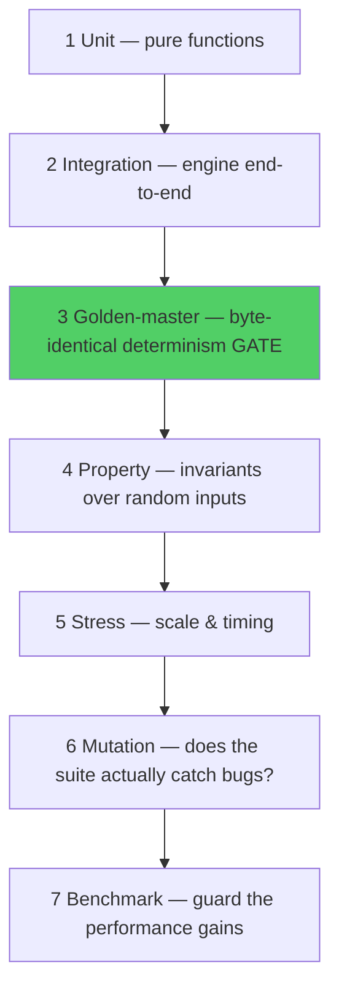
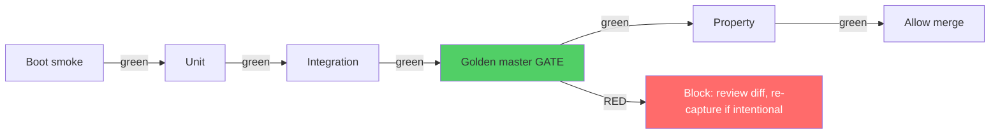

# SchedulingEngine — Test Strategy

**Companion to:** `SchedulingEngine_Architecture_Review.md`
**Current state:** `package.json` declares `"test": "jest"` — and there are **zero test files**. Coverage is 0%. Every refactor in the roadmap is currently a blind change.
**Goal:** a seven-layer suite with the **golden-master determinism gate** at its centre (the mechanical check you already identified as essential), reaching **≥80% meaningful coverage**.

---

## 1. Why testing is the highest-leverage investment here

You have two implementations of the same logic (monolith + engine) that have **already drifted** (the SSD rebalance exists in your working copy but not the engine; the test-day semantics differ). Drift is invisible without tests. A golden master makes drift a failing build instead of a production surprise. Concretely, the suite must answer three questions on every commit:

1. **Does it still run?** (boot smoke test)
2. **Does it still produce the same schedule?** (golden master)
3. **Does it still obey the rules?** (property + unit tests on invariants)

---

## 2. Tooling decision: Vitest over Jest

| Criterion | Jest (configured) | **Vitest (recommended)** |
|---|---|---|
| Speed | Slower cold start | Fast (esbuild) |
| ESM | Needs config gymnastics | Native |
| API | `describe/it/expect` | **Same** — near drop-in |
| Coverage | `--coverage` (babel/v8) | v8 built-in |
| Watch DX | Good | Excellent |
| Migration cost | — | Low (same assertions) |

Either works; Vitest matches your stated plan and removes the ESM friction that already bit the module system. If you stay on Jest, everything below still applies verbatim — only the runner config changes.

**Minimal `vitest.config.js`:**
```javascript
import { defineConfig } from 'vitest/config';
export default defineConfig({
  test: {
    environment: 'node',            // engine is DOM-free — run it in Node (fast)
    coverage: { provider: 'v8', reporter: ['text','html'], lines: 80, functions: 80, branches: 70 },
    setupFiles: ['./tests/setup.js'] // sets TZ=Africa/Johannesburg, loads SchedulerUtils
  }
});
```

**`tests/setup.js`** (the timezone matters — your bugs are timezone-dependent):
```javascript
process.env.TZ = 'Africa/Johannesburg';   // run the suite in the tz you deploy in
globalThis.window = globalThis;            // let window.X = ... assignments land
require('../src/core/utils.js');           // define SchedulerUtils for Node
```

---

## 3. The seven layers



---

## 4. Layer 1 — Unit tests (pure functions)

Target the leaf functions where bugs are cheapest to catch. These also pin the P0-3 timezone fix.

```javascript
import U from '../../src/core/utils.js';

describe('SchedulerUtils', () => {
  test('parseTimeStr / timeStr round-trip', () => {
    expect(U.parseTimeStr('06:30')).toBe(390);
    expect(U.timeStr(390)).toBe('06:30');
    expect(U.timeStr(1290)).toBe('21:30');
  });

  test('timeStr wraps underflow (opening minus 1h) — not "-1:30"', () => {
    expect(U.timeStr(U.parseTimeStr('06:30') - 60)).toBe('05:30');
  });

  test('localDateStr is timezone-stable (the P0-3 fix)', () => {
    const d = new Date('2025-10-15T00:00:00'); d.setDate(d.getDate() - 1);
    expect(U.localDateStr(d)).toBe('2025-10-14');     // monolith's toISOString gives 2025-10-13
  });

  test('overlap is half-open', () => {
    expect(U.overlap(540, 600, 600, 660)).toBe(false); // touching, not overlapping
    expect(U.overlap(540, 660, 600, 720)).toBe(true);
  });

  test('weekIndexInMonth groups Sun-start weeks', () => {
    expect(U.weekIndexInMonth('2025-10-01')).toBe(U.weekIndexInMonth('2025-10-04'));
  });
});
```

**Also unit-test:** `ContractManager.validateHours` (clamps to [1,72]), `AvailabilityManager.validate` (overlap detection), `getChainPreferenceScore` (peak 2–5h, −5 isolated, −100 over 5h), the SSD ΔSSD formula in isolation.

---

## 5. Layer 2 — Integration tests (engine end-to-end on real data)

Use the **real** `schedule.csv`-derived scenario. This is what the review harness does.

```javascript
import { makeEngine, realStudents } from '../helpers.js';

describe('runSchedule — real Sept 2025 data', () => {
  let shifts, engine;
  beforeEach(() => { engine = makeEngine(realStudents, 2025, 8); shifts = engine.runSchedule(2025, 8); });

  test('no over-capacity anywhere', () => {
    for (const s of shifts) expect(s.assignees.length).toBeLessThanOrEqual(s.maxCapacity);
  });
  test('every assignee is actually available for their slot', () => {
    for (const s of shifts) for (const sid of s.assignees)
      expect(engine.isStudentAvailable(sid, s.date, s.start, s.end, engine.getAvailability(sid))).toBe(true);
  });
  test('no assignment violates a hard constraint', () => {
    for (const s of shifts) for (const sid of s.assignees) {
      const raw = engine.state.schedule[`${s.date} ${s.start}`];
      expect(engine.validateAssignment(sid, raw)).toHaveLength(0);
    }
  });
  test('monthly hours within contracted caps', () => {
    const hrs = hoursByStudent(shifts);
    for (const st of realStudents) expect(hrs[st.name] || 0).toBeLessThanOrEqual(st.contracted_monthly_hours);
  });
  test('dense real data reaches full coverage', () => {
    const filled = shifts.filter(s => s.assignees.length >= s.required).length;
    expect(filled / shifts.length).toBeGreaterThan(0.99);   // 7-student real data ≈ 100%
  });
});
```

---

## 6. Layer 3 — Golden-master (the determinism gate) ★

The centrepiece. Capture once; fail the build on **any** byte change. This is the mechanical check that makes modularisation safe — after each module extraction, output must be byte-identical.

**Capture (one-off script, `tests/golden/capture.js`):**
```javascript
const crypto = require('crypto');
const { makeEngine, realStudents } = require('../helpers');
const shifts = makeEngine(realStudents, 2025, 8).runSchedule(2025, 8);
const canonical = JSON.stringify(shifts.map(s => ({
  d: s.date, s: s.start, e: s.end, a: [...s.assignees].sort()   // sort → order-independent
})));
const hash = crypto.createHash('sha256').update(canonical).digest('hex');
require('fs').writeFileSync(__dirname + '/baseline.json', JSON.stringify({ hash, canonical }, null, 2));
console.log('baseline hash', hash);
```

**Guard (`tests/golden/golden.spec.js`):**
```javascript
import baseline from './baseline.json';
import { makeEngine, realStudents } from '../helpers';
import crypto from 'crypto';

test('schedule output is byte-identical to baseline', () => {
  const shifts = makeEngine(realStudents, 2025, 8).runSchedule(2025, 8);
  const canonical = JSON.stringify(shifts.map(s => ({ d:s.date,s:s.start,e:s.end,a:[...s.assignees].sort() })));
  const hash = crypto.createHash('sha256').update(canonical).digest('hex');
  if (hash !== baseline.hash) {
    // helpful diff on failure
    const diff = firstDifference(JSON.parse(baseline.canonical), JSON.parse(canonical));
    throw new Error(`Golden master changed at ${diff}. If intentional, re-run capture.js and review the diff.`);
  }
  expect(hash).toBe(baseline.hash);
});
```

**Workflow rule:** a change that legitimately alters output (e.g. porting SSD rebalance) **must** be a deliberate two-step: (1) review the diff, (2) re-capture the baseline in the *same* commit. An accidental change fails CI.

**Golden masters to keep:** (a) the dense 7-student month (parity), (b) a sparse month (greedy under-fill behaviour), (c) an exam-heavy month (assessment path), (d) a 5-week month (weekly-divisor behaviour). Each pins a different code path.

---

## 7. Layer 4 — Property-based tests (invariants)

Generate random-but-valid inputs; assert the laws that must hold for *every* schedule. (Use `fast-check`.)

```javascript
import fc from 'fast-check';
import { makeEngine } from '../helpers';

const arbStudents = fc.array(arbStudent(), { minLength: 3, maxLength: 40 });

test('INVARIANT: no slot exceeds capacity, ever', () => {
  fc.assert(fc.property(arbStudents, fc.integer({min:0,max:11}), (students, month) => {
    const shifts = makeEngine(students, 2025, month).runSchedule(2025, month);
    return shifts.every(s => s.assignees.length <= s.maxCapacity);
  }));
});

test('INVARIANT: weekly hours never exceed weekly_max', () => {
  fc.assert(fc.property(arbStudents, (students) => {
    const e = makeEngine(students, 2025, 8); e.runSchedule(2025, 8);
    return students.every(st => maxWeeklyHours(e, st.id) <= st.weekly_max_hours + 1e-9);
  }));
});

test('INVARIANT: a student is never double-booked in the same hour', () => {
  fc.assert(fc.property(arbStudents, (students) => {
    const shifts = makeEngine(students, 2025, 8).runSchedule(2025, 8);
    return noStudentOverlaps(shifts);
  }));
});

test('INVARIANT: fairness equals recomputed edges (no drift, the P0-4 law)', () => {
  fc.assert(fc.property(arbStudents, (students) => {
    const e = makeEngine(students, 2025, 8); e.runSchedule(2025, 8); e.rebalance();
    const reported = JSON.stringify(e.state.fairness); e.recalculateFairness();
    return JSON.stringify(e.state.fairness) === reported;
  }));
});

test('INVARIANT: rebalance never increases SSD (the Fix C law)', () => {
  fc.assert(fc.property(arbStudents, (students) => {
    const e = makeEngine(students, 2025, 8); e.runSchedule(2025, 8);
    const before = ssd(e); e.rebalance(); return ssd(e) <= before + 1e-9;
  }));
});
```

---

## 8. Layer 5 — Stress / scale tests

```javascript
test('100 students, full month completes under budget', () => {
  const students = makeNStudents(100);
  const t0 = performance.now();
  makeEngine(students, 2025, 8).runSchedule(2025, 8);
  expect(performance.now() - t0).toBeLessThan(3000);   // tighten to <1000 after perf fixes
});

test('3-month view scales linearly, not super-linearly', () => {
  const students = makeNStudents(40);
  const one = time(() => makeEngine(students,2025,8).runSchedule(2025,8));
  const three = time(() => makeEngine(students,2025,8).generateThreeMonthSchedules());
  expect(three).toBeLessThan(one * 4);   // ~3× plus overhead, not 9×
});
```

---

## 9. Layer 6 — Mutation testing (is the suite real?)

Coverage % lies; mutation testing tells you whether tests *catch* bugs. Use **Stryker**.

```javascript
// stryker.conf.json
{ "testRunner": "vitest", "mutate": ["src/engine/**/*.js","src/core/**/*.js"],
  "thresholds": { "high": 80, "low": 60, "break": 50 } }
```

Mutations the suite **must** kill (if any survives, add a test):
- `>` → `>=` in the capacity check (B5 must fail).
- `H_a - H_b > h` → `>=` in SSD gate (C8 must fail — would break convergence).
- `localDateStr` → `toISOString().slice(0,10)` (B1/B2 must fail — re-introduces the UTC bug).
- delete the `skipExtension` guard (B4 must fail — recursion returns).
- `recalculateFairness` no-op (the fairness-drift invariant must fail).

---

## 10. Layer 7 — Performance benchmark (guards §5 of the review)

A committed benchmark with a regression alarm, so the perf work can't silently rot.

```javascript
// tests/perf/benchmark.js  (run in CI, compare to committed numbers)
const sizes = [5, 10, 20, 40, 60, 100];
const results = sizes.map(n => {
  const students = makeNStudents(n);
  const t0 = performance.now();
  makeEngine(students, 2025, 8).runSchedule(2025, 8);
  return { n, ms: +(performance.now() - t0).toFixed(1) };
});
// assert no size regressed > 20% vs tests/perf/baseline.json
```

---

## 11. Coverage targets & CI

| Scope | Lines | Functions | Branches |
|---|---|---|---|
| `src/core` (utils) | 100% | 100% | 95% |
| `src/engine` | 90% | 90% | 80% |
| `src/domain` (managers) | 85% | 85% | 75% |
| `src/io` (csv/parse/export) | 80% | 80% | 70% |
| `src/ui` (views) | 50% | smoke + escaping only | — |
| **Overall** | **≥80%** | **≥80%** | **≥70%** |

**CI pipeline (`.github/workflows/test.yml`):**
```yaml
- run: npm ci
- run: TZ=Africa/Johannesburg npm test -- --coverage   # unit+integration+property
- run: node tests/golden/golden.spec.js                 # determinism gate (must pass)
- run: node tests/perf/benchmark.js                     # perf regression alarm
- run: npx stryker run                                  # weekly, not every push
```

---

## 12. Test execution order & gating (matches your sequencing)



**Rule:** the golden master is a **required** status check. It is the contract that lets you modularise aggressively (Refactoring Guide) while guaranteeing the daily schedule doesn't change underfoot.

---

## 13. First-week test backlog (do these in Sprint 1)

The minimum set that makes the rest of the roadmap safe — maps to checklist items B1–B6, A15, A19–A20:

1. Boot smoke (all `window.*` defined).
2. `SchedulerUtils` unit tests (Layer 1).
3. Golden master captured + guarded on the real data.
4. Six P0/P1 regression tests (timezone, fairness drift, recursion, capacity, determinism, weekly window).

With those green, you can start Sprint 2 (performance) knowing any behavioural change will trip the gate.
